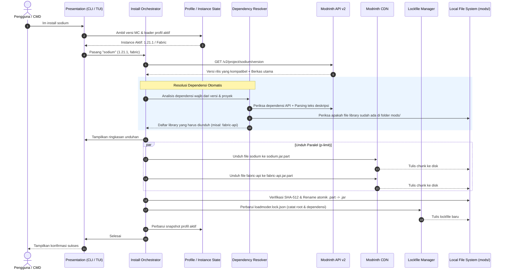

# 01 — Arsitektur & Visi Sistem LoadModer

Dokumen ini menjelaskan arsitektur perangkat lunak, batas modular, alur data, dan mekanisme komunikasi API pada **LoadModer** (`lm`).

---

## 1. Visi & Masalah yang Diselesaikan

Pengelolaan mod Minecraft konvensional memiliki beberapa masalah praktis:
1. **Launcher GUI Berat**: Membutuhkan resource sistem tinggi dan tidak dapat dijalankan di terminal headless atau server VPS.
2. **Pemasangan Manual**: Menyalin file `.jar` secara manual ke folder `mods/` rentan kesalahan versi, tidak mendeteksi library dependensi wajib, dan meninggalkan file usang tak terpakai saat mod dihapus.
3. **Konflik Multi-Versi**: Berpindah versi Minecraft dalam instance yang sama sering mencampurkan file `.jar` dari versi berbeda yang menyebabkan game crash saat startup.

**LoadModer** menyelesaikan masalah ini dengan pendekatan package manager modern:
* **Eksekusi Cepat**: Berbasis Node.js 20+ native fetch tanpa runtime berat.
* **Pendeteksi Otomatis**: Memindai direktori launcher Minecraft di komputer pengguna.
* **Resolusi Dependensi**: Mendeteksi dan mengunduh library yang diwajibkan secara otomatis sesuai loader dan versi Minecraft aktif.
* **Isolasi State & Profil**: Mengarsipkan file mod per kombinasi versi game dan loader dalam snapshot lokal (`.loadmoder/snapshots/`).
* **Deterministik**: Mencatat relasi modul pada lockfile (`loadmoder.lock.json`) untuk mencegah duplikasi dan membersihkan dependensi yatim (*orphan pruning*).

---

## 2. Arsitektur Berlapis (Layered Architecture)

Sistem dibagi menjadi empat lapisan dengan pemisahan tanggung jawab yang tegas:

```
┌────────────────────────────────────────────────────────────────────────┐
│                   PRESENTATION LAYER (CLI & DUAL UX)                   │
│  Interactive TUI Dashboard (Home) │ Commander Router (CLI Commands)    │
│  Keyboard Navigation (@inquirer)  │ Figlet & Nordic Clean Theme        │
│  Boxen Cards & Metadata           │ Cli-Table3 Border Tables           │
└───────────────────────────────────┬────────────────────────────────────┘
                                    │
┌───────────────────────────────────▼────────────────────────────────────┐
│                    APPLICATION / ORCHESTRATION LAYER                   │
│   Install Orchestrator │ Update Engine │ Bisect Runner │ Watch Engine  │
└───────────────────┬───────────────────────────────┬────────────────────┘
                    │                               │
┌───────────────────▼───────────────┐   ┌───────────▼────────────────────┐
│        CORE DOMAIN ENGINES        │   │    INSTANCE & STATE DOMAIN     │
│ • Modpack Engine (.mrpack unpack) │   │ • Launcher Auto-Discovery      │
│ • Dependency Resolver & DAG Graph │   │ • Lockfile Manager (.lock.json)│
│ • Dynamic Minecraft Versions API  │   │ • Profile Snapshot Manager     │
│ • Environment Filter (Client/Srv) │   │ • Mod Disabler (.disabled)     │
└───────────────────┬───────────────┘   └───────────┬────────────────────┘
                    │                               │
┌───────────────────▼───────────────────────────────▼────────────────────┐
│                  INFRASTRUCTURE & ADAPTER LAYER                        │
│   Modrinth API Client (v2) │ Parallel Download Pool │ Streaming Crypto│
│   (Node:Fetch + RateLimit) │ (p-limit Concurrency)  │ (Node:Crypto)   │
└────────────────────────────────────────────────────────────────────────┘
```

### A. Presentation Layer (Dual-Mode CLI & TUI)
* **Interactive Dashboard TUI (`lm` / `lm home`)**: Antarmuka berbasis menu interaktif `@inquirer/prompts` dengan kontrol panah (`↑`/`↓`) atau vim-keys (`j`/`k`).
* **Direct Command Router (`commander`)**: Parser CLI langsung (`lm install`, `lm search`, `lm profile`, `lm bisect`).
* **Komponen Visual**: Header banner Nordic Clean (`src/ui/theme.ts`), kartu ringkasan (`boxen`), dan tabel status (`cli-table3`).

### B. Application & Orchestration Layer
* Mengoordinasikan alur operasi:
  1. Menentukan jenis target (mod biasa, modpack `.mrpack`, shader, atau resource pack).
  2. Memverifikasi kompatibilitas terhadap profil aktif pengguna.
  3. Memanggil *Automatic Dependency Resolver* untuk library prasyarat.
  4. Menyimpan perubahan ke `loadmoder.lock.json` dan snapshot profil.

### C. Core Domain Engines
* **Dynamic Minecraft Versions Engine** (`src/core/minecraft/versions.ts`):
  Mengambil daftar versi rilis resmi Minecraft ($\ge$ 1.16) langsung dari endpoint Modrinth API, mengurutkan secara semantik, dan menyimpannya dalam cache lokal (TTL 1 jam) dengan fallback offline.
* **Automatic Dependency Resolver** (`src/core/dependency/resolver.ts`):
  Mendeteksi library yang dibutuhkan melalui metadata resmi API Modrinth dan parsing deskripsi mod, lalu mengunduh versi yang cocok untuk loader dan versi game aktif.
* **Modpack Engine** (`src/core/modpack/unpacker.ts`):
  Membaca dan mengekstrak berkas `.mrpack`, memvalidasi manifest `modrinth.index.json` via Zod, memproses folder `overrides/`, dan memfilter komponen sesuai target `client` atau `server`.
* **Profile Snapshot Manager** (`src/core/profile/snapshotManager.ts`):
  Mengarsipkan dan memulihkan berkas mod ke folder snapshot saat pengguna berganti konfigurasi via `lm profile switch`.
* **Dependency DAG & Lockfile Manager** (`src/core/dependency/graph.ts`):
  Mencatat Directed Acyclic Graph (DAG) di `loadmoder.lock.json`, menghitung relasi referensi (`dependedBy`), dan membersihkan dependensi yang tidak lagi terpakai saat mod induk dihapus via `lm remove --prune`.

### D. Infrastructure & Adapter Layer
* **Modrinth API Client** (`src/api/client.ts`):
  Klien HTTP resmi Modrinth API v2 (`https://api.modrinth.com/v2`), mematuhi kuota rate limit (300 req/menit), menyertakan header `User-Agent` terstruktur, dan menangani HTTP `429` via retry backoff.
* **Parallel Download Pool**:
  Mengatur antrean unduhan multi-berkas dengan pembatas konkurensi `p-limit` (default: 4 koneksi simultan).
* **Streaming I/O & Crypto** (`src/utils/crypto.ts`):
  Menghitung hash SHA-1 dan SHA-512 secara streaming saat file dialirkan ke disk.

---

## 3. Alur Data Pemasangan Mod (Data Flow)



---

## 4. Keamanan, Integritas Berkas, dan Manajemen API

### A. Kebijakan Header User-Agent
Setiap permintaan HTTP menyertakan header `User-Agent` terstruktur:
```text
User-Agent: hafiznovelrianto/loadmoder/2.0.0 (contact@example.com)
```
Informasi kontak dapat ditentukan pengguna melalui variabel lingkungan `LOADMODER_CONTACT`.

### B. Penanganan Rate-Limit
Modrinth membatasi permintaan hingga 300 req/menit per IP:
1. Klien membaca header `X-Ratelimit-Remaining` dan `X-Ratelimit-Reset`.
2. Jika menerima HTTP `429 Too Many Requests`, klien membaca waktu tunggu dari header `X-Ratelimit-Reset` (+ buffer 250ms), lalu mengulang permintaan hingga maksimal 3 kali.
3. Operasi pembaruan massal memanfaatkan endpoint batch:
   - `POST /v2/version_files`: Mengecek ratusan hash file lokal dalam 1 request.
   - `POST /v2/version_files/update`: Mengecek pembaruan seluruh mod sekaligus.
   - `GET /v2/projects?ids=[...]`: Mengambil metadata banyak mod dalam 1 request.

### C. Integritas Unduhan
* Berkas sementara diunduh dengan ekstensi `.part`.
* Checksum SHA-512 diverifikasi secara streaming setelah unduhan selesai.
* Jika checksum tidak cocok, berkas `.part` langsung dihapus dan operasi dibatalkan.
* Berkas hanya di-*rename* menjadi `.jar` setelah checksum diverifikasi valid.
