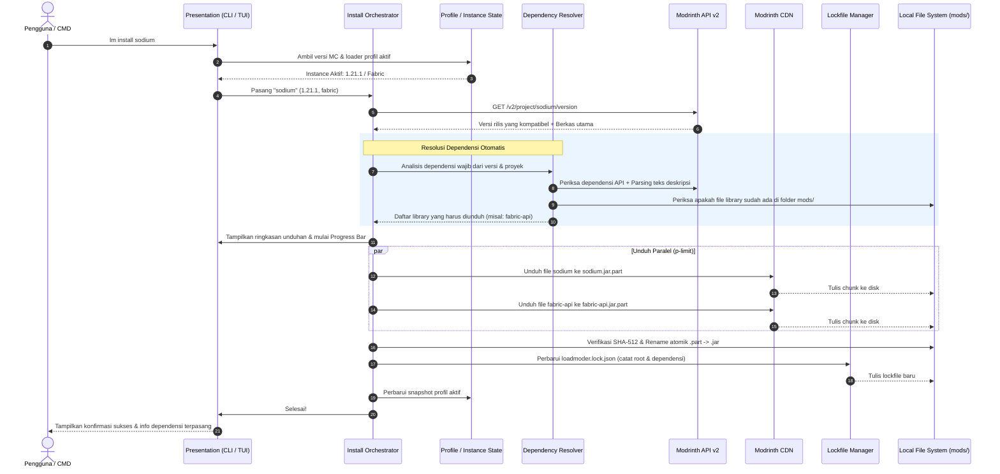

# 01 — Arsitektur & Visi Sistem LoadModer

Dokumen ini menjelaskan arsitektur tingkat tinggi, prinsip desain, dan visi sistem dari **LoadModer** sebagai platform manajemen mod dan modpack berbasis Command Line Interface (CLI) dan Terminal User Interface (TUI).

---

## 1. Visi: "NPM & Cargo untuk Ekosistem Minecraft"

Pengelolaan modifikasi Minecraft selama ini terpecah di antara:
1. **GUI Launcher Pihak Ketiga** yang berat dan bergantung penuh pada antarmuka grafis.
2. **Pengelolaan Manual** (drag-and-drop file `.jar` ke folder `%APPDATA%\.minecraft\mods`) yang rawan konflik, sulit diperbarui, dan meninggalkan berkas library yatim (*orphan dependencies*).
3. **Lingkungan Server Headless / VPS** yang menyulitkan administrator server mengunduh dan menyinkronkan mod tanpa antarmuka visual.

**LoadModer** menjembatani kesenjangan tersebut dengan mengadopsi standar package manager modern (seperti `cargo` di Rust atau `pnpm` di Node.js):
* **Cepat & Efisien**: Startup instan, overhead memori rendah, dan eksekusi berbasis Node.js 20+ native fetch.
* **Otomatis & Terintegrasi**: Mendeteksi instance launcher secara mandiri tanpa input path manual.
* **Resolusi Dependensi Cerdas**: Mengunduh modul library yang diwajibkan secara otomatis dan memverifikasinya terhadap mod loader serta versi Minecraft aktif.
* **Isolasi State & Profil**: Menggunakan snapshot profil untuk mencegah file mod bercampur saat berpindah versi Minecraft atau mod loader.
* **Reproducible**: Menggunakan file kunci (`loadmoder.lock.json`) untuk memastikan daftar dan silsilah mod tercatat secara konsisten.

---

## 2. Arsitektur Berlapis (Layered Architecture)

LoadModer dibangun dengan prinsip arsitektur modular yang memisahkan tanggung jawab sistem secara tegas:

```
┌────────────────────────────────────────────────────────────────────────┐
│                   PRESENTATION LAYER (CLI & DUAL UX)                   │
│  Interactive TUI Dashboard (Home) │ Commander Router (CLI Commands)    │
│  Keyboard Arrow Engine (Raw Mode) │ Figlet & Neon Theme Banner         │
│  Boxen Rounded Cards & Metadata   │ Cli-Table3 Rounded Border Tables   │
└───────────────────────────────────┬────────────────────────────────────┘
                                    │
┌───────────────────────────────────▼────────────────────────────────────┐
│                    APPLICATION / ORCHESTRATION LAYER                   │
│   Install Orchestrator │ Update Engine │ Bisect Runner │ Watch Engine  │
└───────────────────┬───────────────────────────────┬────────────────────┘
                    │                               │
┌───────────────────▼───────────────┐   ┌───────────▼────────────────────┐
│        CORE DOMAIN ENGINES        │   │    INSTANCE & STATE DOMAIN     │
│ • Modpack Engine (.mrpack unpack) │   │ • Launcher Auto-Discovery      │
│ • Dependency Resolver & DAG Graph │   │ • Lockfile Manager (.lock.json)│
│ • Dynamic Minecraft Versions API  │   │ • Profile Snapshot Manager     │
│ • Environment Filter (Client/Srv) │   │ • Mod Disabler (.disabled)     │
└───────────────────┬───────────────┘   └───────────┬────────────────────┘
                    │                               │
┌───────────────────▼───────────────────────────────▼────────────────────┐
│                  INFRASTRUCTURE & ADAPTER LAYER                        │
│   Modrinth API Client (v2) │ Parallel Download Pool │ Streaming Crypto│
│   (Undici / Fetch + Retry) │ (p-limit & Range HTTP) │ (Node:Crypto)   │
└────────────────────────────────────────────────────────────────────────┘
```

### A. Presentation Layer (Dual-Mode CLI & TUI)
* **Interactive Dashboard TUI (`lm` / `lm home`)**: Menampilkan antarmuka interaktif dengan kontrol keyboard (`↑`/`↓` atau `j`/`k`), tabel ringkasan filter aktif vertikal, dan browser konten terpadu.
* **Direct Command Router (`commander`)**: Menangani pemanggilan perintah langsung via terminal (`lm install`, `lm search`, `lm profile`, `lm bisect`).
* **Visual Components**: Kotak berbingkai bulat (`boxen`), tabel ANSI (`cli-table3`), dan status progres (`ora` + `cli-progress`).

### B. Application & Orchestration Layer
* Mengoordinasikan alur bisnis sistem:
  1. Mendeteksi apakah target pemasangan adalah mod tunggal atau modpack (`.mrpack`).
  2. Memverifikasi kompatibilitas terhadap instance atau profil aktif.
  3. Mengaktifkan *Automatic Dependency Resolver* untuk menelusuri library wajib.
  4. Menyimpan status perubahan ke dalam `loadmoder.lock.json` dan snapshot profil lokal.

### C. Core Domain Engines
* **Dynamic Minecraft Versions Engine** (`src/core/minecraft/versions.ts`):
  Mengambil daftar versi resmi Minecraft secara dinamis dari endpoint tag Modrinth API, memfilter versi $\ge$ 1.16, dan menyimpannya dalam cache lokal berdurasi 24 jam dengan pembaruan otomatis saat versi baru dirilis.
* **Automatic Dependency Resolver** (`src/core/dependency/resolver.ts`):
  Mendeteksi library yang dibutuhkan oleh mod baik melalui metadata resmi API Modrinth maupun analisis teks deskripsi proyek (regex parsing), lalu mengunduh versi yang tepat untuk loader dan versi game yang aktif.
* **Modpack Engine** (`src/core/modpack/unpacker.ts`):
  Mengekstrak berkas `.mrpack`, membaca manifest `modrinth.index.json`, menerapkan file `overrides/`, dan memfilter komponen berdasarkan target environment (`client` / `server`).
* **Profile Snapshot Manager** (`src/core/profile/snapshotManager.ts`):
  Menyimpan dan memulihkan kondisi file folder `mods` secara terisolasi saat pengguna beralih versi Minecraft atau mod loader, mencegah hilangnya mod atau terjadinya konflik antar versi.
* **Dependency DAG & Lockfile Manager** (`src/core/dependency/graph.ts`):
  Membangun graf dependensi terarah (DAG), menghitung *reference count* tiap library, dan melakukan pembersihan otomatis (*orphan pruning*) saat mod utama dihapus.

### D. Infrastructure & Adapter Layer
* **Modrinth API Client** (`src/api/client.ts`):
  Berkomunikasi dengan Labrinth API v2 (`https://api.modrinth.com/v2`), mematuhi aturan rate-limit (300 req/menit), menyertakan header `User-Agent` resmi, serta menangani kode HTTP `429` dengan mekanisme *exponential backoff retry*.
* **Parallel Download Pool**:
  Mengatur antrean unduhan dengan pembatas konkurensi (`p-limit`) untuk mengoptimalkan penggunaan bandwidth tanpa memicu penalti rate limit.
* **Streaming I/O & Crypto** (`src/utils/crypto.ts`):
  Menghitung hash SHA-1 dan SHA-512 secara streaming saat file diunduh untuk menjaga konsumsi memori tetap rendah.

---

## 3. Alur Data Sistem (End-to-End Data Flow)

Berikut adalah urutan alur ketika pengguna menginstal sebuah mod:



---

## 4. Keamanan, Integritas Berkas, dan Manajemen API

### A. Kebijakan Header User-Agent
Setiap permintaan HTTP menyertakan header `User-Agent` yang unik sesuai spesifikasi Modrinth API:
```text
User-Agent: hafiznovelrianto/loadmoder/2.0.0 (contact@example.com)
```

### B. Rate-Limit Handling (Exponential Backoff)
Modrinth menerapkan batas standar **300 permintaan per menit per alamat IP**.
1. Klien membaca header `X-Ratelimit-Remaining` dan `X-Ratelimit-Reset`.
2. Jika respons HTTP `429 Too Many Requests` diterima, klien menunggu selama durasi yang ditentukan oleh `X-Ratelimit-Reset` ditambah buffer 250ms, lalu mengulang otomatis hingga maksimal 3 kali percobaan.
3. Operasi massal selalu diprioritaskan menggunakan endpoint batch:
   - `POST /v2/version_files` (mendeteksi ratusan file sekaligus).
   - `POST /v2/version_files/update` (memeriksa pembaruan seluruh mod dalam 1 HTTP request).
   - `GET /v2/projects?ids=[...]` (mengambil metadata banyak proyek secara kolektif).

### C. Integritas Unduhan (Zero-Corruption Guarantee)
* Berkas sementara ditulis dengan ekstensi `.part`.
* Checksum SHA-512 diverifikasi secara streaming langsung dari stream data unduhan.
* Jika checksum tidak cocok, file `.part` langsung dihapus dan dilaporkan sebagai error.
* File hanya di-*rename* menjadi `.jar` setelah lolos verifikasi integritas 100%.
