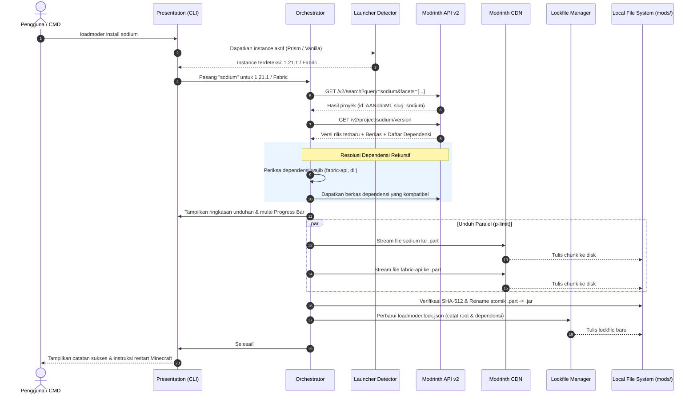

# 01 — Arsitektur & Visi Sistem LoadModer

Dokumen ini menjelaskan arsitektur tingkat tinggi, prinsip desain, dan visi sistem dari **LoadModer** sebagai platform manajemen mod dan modpack berbasis Command Line Interface (CLI).

---

## 1. Visi: "NPM & Cargo untuk Ekosistem Minecraft"

Selama ini, ekosistem modding Minecraft terpecah antara:
1. **GUI Launcher Pihak Ketiga** (Prism, CurseForge, Modrinth App) yang berat dan bergantung pada antarmuka visual.
2. **Pengelolaan Manual** (drag-and-drop file `.jar` ke folder `%APPDATA%\.minecraft\mods`) yang rawan konflik, sulit diperbarui, dan meninggalkan berkas dependensi tak terpakai (*orphan*).
3. **Server Headless / VPS** yang menyulitkan sysadmin mengunduh dan menyinkronkan mod tanpa antarmuka grafis.

**LoadModer** hadir menjembatani kesenjangan tersebut. LoadModer memposisikan dirinya seperti `cargo` (Rust) atau `npm` (Node.js):
* **Cepat & Ringan**: Waktu startup < 100ms, konsumsi RAM minimal.
* **Otomatis & Cerdas**: Menemukan instance launcher secara mandiri tanpa input path manual.
* **Terstruktur & Terlacak**: Menggunakan file kunci (`loadmoder.lock.json`) untuk memastikan lingkungan mod yang *reproducible*.
* **Universal**: Mendukung Mod tunggal, Modpack resmi (`.mrpack`), Shaders, Resource Pack, hingga Datapack.

---

## 2. Arsitektur Berlapis (Layered Architecture)

LoadModer mengadopsi prinsip arsitektur modular yang memisahkan tanggung jawab kode secara tegas:

```
┌────────────────────────────────────────────────────────────────────────┐
│                   PRESENTATION LAYER (CLI & DUAL UX)                   │
│  Interactive TUI Dashboard (Home) │ Commander Router (CLI Commands)    │
│  Keyboard Arrow Engine (Raw Mode) │ Figlet & Neon Gradient Banner      │
│  Boxen Rounded Cards & Metadata   │ Cli-Table3 Rounded Border Tables   │
└───────────────────────────────────┬────────────────────────────────────┘
                                    │
┌───────────────────────────────────▼────────────────────────────────────┐
│                    APPLICATION / ORCHESTRATION LAYER                   │
│   Install Orchestrator │ Update Engine │ Bisect Runner │ Sync Manager  │
└───────────────────┬───────────────────────────────┬────────────────────┘
                    │                               │
┌───────────────────▼───────────────┐   ┌───────────▼────────────────────┐
│        CORE DOMAIN ENGINES        │   │    INSTANCE & STATE DOMAIN     │
│ • Modpack Engine (.mrpack unpack) │   │ • Launcher Auto-Discovery      │
│ • Dependency DAG & Orphan Prune   │   │ • Lockfile Manager (.lock.json)│
│ • Environment Filter (Client/Srv) │   │ • Mod Disabler (.disabled)     │
└───────────────────┬───────────────┘   └───────────┬────────────────────┘
                    │                               │
┌───────────────────▼───────────────────────────────▼────────────────────┐
│                  INFRASTRUCTURE & ADAPTER LAYER                        │
│   Modrinth API Client (v2) │ Parallel Download Pool │ Streaming Crypto│
│   (Undici / Fetch + Retry) │ (p-limit & Range HTTP) │ (Node:Crypto)   │
└────────────────────────────────────────────────────────────────────────┘
```

### A. Presentation Layer (Dual-Mode CLI & TUI UX)
* **Mode Dashboard Interaktif (`home` / tanpa argumen)**: Menampilkan antarmuka navigasi keyboard penuh bergaya `anichi-cli` dengan banner teks ASCII ANSI Shadow bergradasi neon cyan-pink (`figlet` + `gradient-string`), scroll table dengan pointer `❯`, serta penyorotan baris aktif berlatar `#0f172a`.
* **Mode Perintah Langsung (*Direct CLI*)**: Menerima input perintah dan flag instan via `commander` (`lm install`, `lm search`, `lm update`).
* **Komponen Visual & Kotak Metadata**: Kotak kartu berbingkai bulat (`boxen`), tabel bergaya minimalis (`cli-table3`), dan status progres unduhan (`cli-progress` / `ora`).
* **Pewarnaan Konsisten**: Tema neon cyberpunk terpadu (Cyan `#00f5ff`, Pink `#ff007f`, Green `#00ff9f`, Slate `#64748b`).

### B. Application & Orchestration Layer
* Mengoordinasikan alur bisnis: misalnya perintah `loadmoder install fabulously-optimized` akan memicu:
  1. Deteksi apakah input merupakan modpack atau mod biasa.
  2. Pengecekan kompatibilitas loader & versi Minecraft pada instance aktif.
  3. Pendelegasian ke Modpack Engine atau Dependency Resolver.
  4. Penyimpanan snapshot akhir ke dalam file lockfile.

### C. Core Domain Engines
* **Modpack Engine**: Mengekstrak arsip `.mrpack`, membaca spesifikasi `modrinth.index.json`, dan memetakan folder `overrides/`.
* **Dependency DAG**: Membangun pohon relasi dependensi mod, mendeteksi inkompatibilitas, dan menjalankan *garbage collection* saat mod dihapus.
* **Environment Filter**: Menentukan apakah mod/file valid untuk target `client`, `server`, atau keduanya.

### D. Infrastructure & Adapter Layer
* **Modrinth Client**: Berkomunikasi langsung dengan Labrinth API v2 (`https://api.modrinth.com/v2`), mematuhi aturan rate-limit (300 req/min), dan menangani kode status `429` (backoff retry) serta `410` (deprecated).
* **Parallel Download Pool**: Mengatur antrean unduhan dengan batas konkurensi (3–5 koneksi simultan) untuk memaksimalkan bandwidth tanpa memicu throttling API.
* **Streaming I/O & Crypto**: Membaca arsip ZIP dan menghitung hash SHA-1 / SHA-512 secara streaming untuk menjaga pemakaian memori tetap rendah (< 50MB).

---

## 3. Alur Data Sistem (End-to-End Data Flow)

Berikut adalah diagram alur ketika pengguna menjalankan perintah instalasi aset:



---

## 4. Keamanan, Integritas Berkas, dan Manajemen API

### A. Kebijakan Header User-Agent
Sesuai regulasi resmi Modrinth API, setiap permintaan HTTP **wajib** mencantumkan header `User-Agent` yang unik:
```text
User-Agent: hafiznovelrianto/loadmoder/2.0.0 (contact@example.com)
```
LoadModer menginjeksikan header ini di setiap panggilan `fetch` untuk menjamin klien tidak diblokir oleh sistem Cloudflare Modrinth.

### B. Rate-Limit Handling (Exponential Backoff)
Batas laju standar Modrinth adalah **300 permintaan per menit per alamat IP**.
1. Klien membaca header `X-Ratelimit-Remaining` dan `X-Ratelimit-Reset`.
2. Jika menerima HTTP `429 Too Many Requests`, klien tidak akan langsung crash, melainkan tidur (*sleep*) selama durasi yang ditentukan oleh `X-Ratelimit-Reset` ditambah buffer 250ms, lalu mengulang otomatis hingga maksimal 3 kali.
3. Untuk mengurangi konsumsi kuota permintaan, LoadModer selalu mengutamakan endpoint **Batch**:
   * `POST /v2/version_files` (mengidentifikasi ratusan file sekaligus).
   * `POST /v2/version_files/update` (memeriksa pembaruan seluruh mod dalam 1 HTTP request).
   * `GET /v2/projects?ids=[...]` (mengambil metadata banyak proyek sekaligus).

### C. Integritas Unduhan (Zero-Corruption Guarantee)
* Berkas tidak pernah ditulis langsung sebagai `.jar` yang valid saat proses download berlangsung. Berkas ditulis dengan ekstensi `.part`.
* Checksum SHA-512 dihitung secara streaming langsung dari stream unduhan.
* Jika checksum tidak cocok (indikasi unduhan korup atau terputus), file `.part` langsung dihapus seketika dan dilaporkan sebagai error.
* Hanya file yang lolos 100% verifikasi SHA-512 yang di-*rename* menjadi `.jar` secara atomik.
