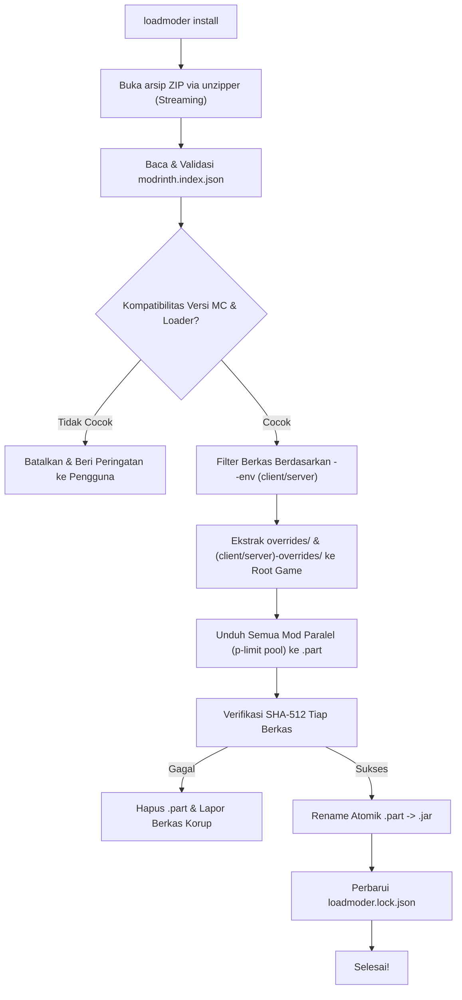

# 04 — Mesin Modpack (.mrpack Engine)

Dokumen ini membedah spesifikasi format modpack resmi Modrinth (`.mrpack`), struktur manifes `modrinth.index.json`, serta arsitektur mesin ekstraksi dan sinkronisasi modpack pada **LoadModer**.

---

## 1. Anatomi Berkas `.mrpack`

Berkas `.mrpack` sebenarnya adalah arsip ZIP standar yang dirancang secara khusus untuk memisahkan **metadata dependensi** dari **konfigurasi lokal**, sehingga ukuran file modpack tetap sangat kecil (sering kali hanya < 500 KB meskipun berisi 100+ mod).

```text
contoh-modpack.mrpack (Arsip ZIP)
├── modrinth.index.json         # MANIFES UTAMA (metadata, daftar mod, hash)
├── overrides/                  # BERKAS UMUM (diekstrak ke root game)
│   ├── config/
│   │   ├── sodium-options.json
│   │   └── minimap.txt
│   ├── resourcepacks/
│   │   └── default-dark-theme.zip
│   └── defaultconfigs/
├── client-overrides/           # BERKAS KHUSUS CLIENT (opsional)
│   └── options.txt
└── server-overrides/           # BERKAS KHUSUS SERVER (opsional)
    └── server.properties
```

---

## 2. Spesifikasi Skema `modrinth.index.json` (Format v1)

Berikut adalah struktur skema JSON lengkap beserta anotasi tipe TypeScript:

```typescript
export interface MrpackFileHash {
  sha1: string;
  sha512: string;
}

export interface MrpackFileEnvironment {
  client: 'required' | 'optional' | 'unsupported';
  server: 'required' | 'optional' | 'unsupported';
}

export interface MrpackFileEntry {
  /** Path relatif tempat file harus diletakkan (misal: "mods/sodium-fabric-0.6.0.jar") */
  path: string;
  hashes: MrpackFileHash;
  env?: MrpackFileEnvironment;
  /** Daftar mirror URL pengunduhan (Modrinth CDN) */
  downloads: string[];
  fileSize: number;
}

export interface MrpackIndex {
  formatVersion: 1;
  game: 'minecraft';
  versionId: string;
  name: string;
  summary?: string;
  files: MrpackFileEntry[];
  dependencies: {
    minecraft: string;
    'fabric-loader'?: string;
    'forge'?: string;
    'neoforge'?: string;
    'quilt-loader'?: string;
    [key: string]: string | undefined;
  };
}
```

### Validasi dengan Zod
LoadModer memvalidasi `modrinth.index.json` saat runtime menggunakan Zod untuk mencegah serangan *path traversal* (`../../`) dan file corrupt:

```typescript
import { z } from 'zod';

export const MrpackIndexSchema = z.object({
  formatVersion: z.literal(1),
  game: z.literal('minecraft'),
  versionId: z.string(),
  name: z.string(),
  summary: z.string().optional(),
  files: z.array(
    z.object({
      path: z.string().refine((p) => !p.includes('..'), {
        message: 'Path traversal tidak diizinkan dalam berkas mrpack',
      }),
      hashes: z.object({
        sha1: z.string(),
        sha512: z.string(),
      }),
      env: z
        .object({
          client: z.enum(['required', 'optional', 'unsupported']),
          server: z.enum(['required', 'optional', 'unsupported']),
        })
        .optional(),
      downloads: z.array(z.string().url()).min(1),
      fileSize: z.number().positive(),
    })
  ),
  dependencies: z.record(z.string()),
});
```

---

## 3. Alur Instalasi Modpack (Pipeline Ekstraksi)



---

## 4. Implementasi Teknis Mesin Modpack (`src/core/modpackEngine.ts`)

Berikut adalah kode produksi mesin modpack yang hemat memori, aman, dan mendukung pembatalan otomatis jika terjadi error:

```typescript
import path from 'node:path';
import { createWriteStream } from 'node:fs';
import { mkdir, rm, rename } from 'node:fs/promises';
import { Readable } from 'node:stream';
import { pipeline } from 'node:stream/promises';
import unzipper from 'unzipper';
import pLimit from 'p-limit';
import { MrpackIndexSchema, type MrpackIndex, type MrpackFileEntry } from './schemas.js';
import type { ModrinthClient } from './modrinthClient.js';
import { hashFile } from './utils.js';

export interface ModpackInstallOptions {
  instanceDir: string;
  targetEnv: 'client' | 'server';
  concurrency?: number;
  onProgress?: (completed: number, total: number, currentFile: string) => void;
}

export class ModpackEngine {
  constructor(private readonly api: ModrinthClient) {}

  /** Membaca manifest modrinth.index.json secara streaming tanpa mengekstrak zip */
  async inspectMrpack(mrpackFilePath: string): Promise<MrpackIndex> {
    const zip = await unzipper.Open.file(mrpackFilePath);
    const indexEntry = zip.files.find((f) => f.path === 'modrinth.index.json');
    if (!indexEntry) {
      throw new Error('Berkas tidak valid: "modrinth.index.json" tidak ditemukan di dalam .mrpack');
    }

    const buffer = await indexEntry.buffer();
    const rawJson = JSON.parse(buffer.toString('utf8'));
    return MrpackIndexSchema.parse(rawJson);
  }

  /** Menjalankan proses instalasi modpack penuh */
  async install(mrpackFilePath: string, opts: ModpackInstallOptions): Promise<void> {
    const index = await this.inspectMrpack(mrpackFilePath);
    const zip = await unzipper.Open.file(mrpackFilePath);

    // 1. Ekstraksi Overrides (Konfigurasi, Resources, Datapacks)
    for (const entry of zip.files) {
      if (entry.path.startsWith('overrides/')) {
        const relPath = entry.path.replace(/^overrides\//, '');
        if (!relPath) continue;
        await this.extractZipEntry(entry, path.join(opts.instanceDir, relPath));
      } else if (opts.targetEnv === 'client' && entry.path.startsWith('client-overrides/')) {
        const relPath = entry.path.replace(/^client-overrides\//, '');
        if (!relPath) continue;
        await this.extractZipEntry(entry, path.join(opts.instanceDir, relPath));
      } else if (opts.targetEnv === 'server' && entry.path.startsWith('server-overrides/')) {
        const relPath = entry.path.replace(/^server-overrides\//, '');
        if (!relPath) continue;
        await this.extractZipEntry(entry, path.join(opts.instanceDir, relPath));
      }
    }

    // 2. Filter Berkas Berdasarkan Lingkungan (Client vs Server)
    const filesToDownload = index.files.filter((file) => {
      if (opts.targetEnv === 'server' && file.env?.server === 'unsupported') return false;
      if (opts.targetEnv === 'client' && file.env?.client === 'unsupported') return false;
      return true;
    });

    // 3. Unduh Seluruh Mod Paralel dengan Concurrency Pool (p-limit)
    const limit = pLimit(opts.concurrency ?? 4);
    let completedCount = 0;

    const downloadTasks = filesToDownload.map((modFile) =>
      limit(async () => {
        await this.downloadModFile(modFile, opts.instanceDir);
        completedCount++;
        opts.onProgress?.(completedCount, filesToDownload.length, modFile.path);
      })
    );

    await Promise.all(downloadTasks);
  }

  private async extractZipEntry(entry: unzipper.File, destPath: string): Promise<void> {
    if (entry.type === 'Directory') {
      await mkdir(destPath, { recursive: true });
    } else {
      await mkdir(path.dirname(destPath), { recursive: true });
      await pipeline(entry.stream(), createWriteStream(destPath));
    }
  }

  private async downloadModFile(file: MrpackFileEntry, instanceDir: string): Promise<void> {
    const finalDest = path.join(instanceDir, file.path);
    const tempDest = `${finalDest}.part`;
    await mkdir(path.dirname(finalDest), { recursive: true });

    const downloadUrl = file.downloads[0];
    if (!downloadUrl) throw new Error(`Tidak ada URL unduhan untuk berkas: ${file.path}`);

    // Unduh file ke ekstensi temporer .part
    const res = await fetch(downloadUrl, {
      headers: { 'User-Agent': this.api.userAgent },
    });
    if (!res.ok || !res.body) throw new Error(`Gagal mengunduh file ${file.path}: HTTP ${res.status}`);

    try {
      await pipeline(Readable.fromWeb(res.body as any), createWriteStream(tempDest));

      // Verifikasi checksum SHA-512
      const actualSha512 = await hashFile(tempDest, 'sha512');
      if (actualSha512.toLowerCase() !== file.hashes.sha512.toLowerCase()) {
        throw new Error(`Checksum SHA-512 tidak cocok untuk ${file.path}. File dibatalkan.`);
      }

      // Rename atomik jika verifikasi lolos
      await rename(tempDest, finalDest);
    } catch (err) {
      await rm(tempDest, { force: true });
      throw err;
    }
  }
}
```

---

## 5. Pembaruan Modpack (Modpack Diffing & Updates)

Ketika versi baru dari modpack dirilis di Modrinth (misal `Fabulously Optimized v5.0` $\rightarrow$ `v5.1`), LoadModer membandingkan manifes lama dan baru:
1. **Removed Files**: File yang ada di manifes lama tetapi sudah dihapus di manifes baru akan dibersihkan dari folder `mods/`.
2. **Changed Versions**: File yang versinya berubah akan diunduh versi barunya dan versi lama dihapus.
3. **Protected Local Configs**: LoadModer tidak menimpa file konfigurasi lokal milik pemain yang sudah diubah secara sengaja (seperti kontrol tombol keybind atau opsi grafis) kecuali jika pengguna menambahkan flag `--force-configs`.
