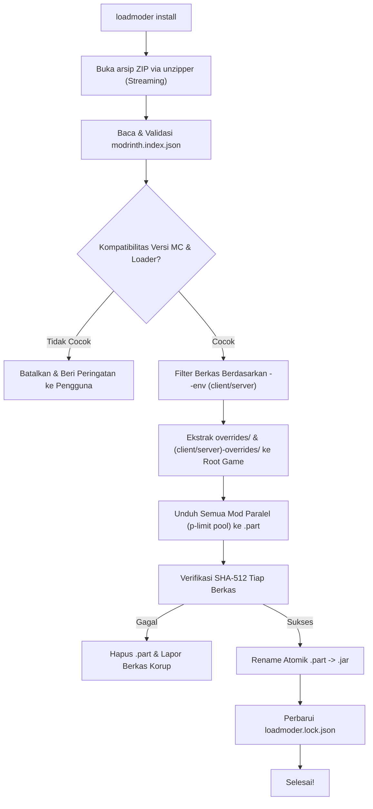
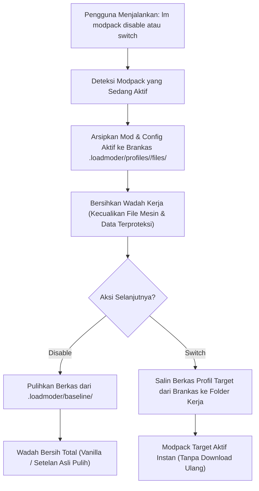

# 04 — Mesin Modpack (.mrpack Engine)

Dokumen ini membedah spesifikasi format modpack resmi Modrinth (`.mrpack`), struktur manifes `modrinth.index.json`, serta arsitektur mesin ekstraksi dan sinkronisasi modpack pada **LoadModer**.

---

## 1. Anatomi Berkas `.mrpack`

Berkas `.mrpack` sebenarnya adalah arsip ZIP standar yang dirancang secara khusus untuk memisahkan **metadata dependensi** dari **konfigurasi lokal**, sehingga ukuran file modpack tetap sangat kecil (sering kali hanya < 500 KB meskipun berisi 100+ mod).

```text
contoh-modpack.mrpack (Arsip ZIP)
├── modrinth.index.json         # MANIFES UTAMA (metadata, daftar mod, hash)
├── overrides/                  # BERKAS UMUM (diekstrak ke root game)
│   ├── config/
│   │   ├── sodium-options.json
│   │   └── minimap.txt
│   ├── resourcepacks/
│   │   └── default-dark-theme.zip
│   └── defaultconfigs/
├── client-overrides/           # BERKAS KHUSUS CLIENT (opsional)
│   └── options.txt
└── server-overrides/           # BERKAS KHUSUS SERVER (opsional)
    └── server.properties
```

---

## 2. Spesifikasi Skema `modrinth.index.json` (Format v1)

Berikut adalah struktur skema JSON lengkap beserta anotasi tipe TypeScript:

```typescript
export interface MrpackFileHash {
  sha1: string;
  sha512: string;
}

export interface MrpackFileEnvironment {
  client: 'required' | 'optional' | 'unsupported';
  server: 'required' | 'optional' | 'unsupported';
}

export interface MrpackFileEntry {
  /** Path relatif tempat file harus diletakkan (misal: "mods/sodium-fabric-0.6.0.jar") */
  path: string;
  hashes: MrpackFileHash;
  env?: MrpackFileEnvironment;
  /** Daftar mirror URL pengunduhan (Modrinth CDN) */
  downloads: string[];
  fileSize: number;
}

export interface MrpackIndex {
  formatVersion: 1;
  game: 'minecraft';
  versionId: string;
  name: string;
  summary?: string;
  files: MrpackFileEntry[];
  dependencies: {
    minecraft: string;
    'fabric-loader'?: string;
    'forge'?: string;
    'neoforge'?: string;
    'quilt-loader'?: string;
    [key: string]: string | undefined;
  };
}
```

### Validasi dengan Zod
LoadModer memvalidasi `modrinth.index.json` saat runtime menggunakan Zod untuk mencegah serangan *path traversal* (`../../`) dan file corrupt:

```typescript
import { z } from 'zod';

export const MrpackIndexSchema = z.object({
  formatVersion: z.literal(1),
  game: z.literal('minecraft'),
  versionId: z.string(),
  name: z.string(),
  summary: z.string().optional(),
  files: z.array(
    z.object({
      path: z.string().refine((p) => !p.includes('..'), {
        message: 'Path traversal tidak diizinkan dalam berkas mrpack',
      }),
      hashes: z.object({
        sha1: z.string(),
        sha512: z.string(),
      }),
      env: z
        .object({
          client: z.enum(['required', 'optional', 'unsupported']),
          server: z.enum(['required', 'optional', 'unsupported']),
        })
        .optional(),
      downloads: z.array(z.string().url()).min(1),
      fileSize: z.number().positive(),
    })
  ),
  dependencies: z.record(z.string()),
});
```

---

## 3. Alur Instalasi Modpack (Pipeline Ekstraksi)



---

## 4. Implementasi Teknis Mesin Modpack (`src/core/modpack/unpacker.ts`)

Berikut adalah kode produksi mesin modpack yang hemat memori, aman, dan mendukung pembatalan otomatis jika terjadi error:

```typescript
import path from 'node:path';
import { createWriteStream } from 'node:fs';
import { mkdir, rm, rename } from 'node:fs/promises';
import { Readable } from 'node:stream';
import { pipeline } from 'node:stream/promises';
import unzipper from 'unzipper';
import pLimit from 'p-limit';
import { MrpackIndexSchema, type MrpackIndex, type MrpackFileEntry } from './schemas.js';
import type { ModrinthClient } from './modrinthClient.js';
import { hashFile } from './utils.js';

export interface ModpackInstallOptions {
  instanceDir: string;
  targetEnv: 'client' | 'server';
  concurrency?: number;
  onProgress?: (completed: number, total: number, currentFile: string) => void;
}

export class ModpackEngine {
  constructor(private readonly api: ModrinthClient) {}

  /** Membaca manifest modrinth.index.json secara streaming tanpa mengekstrak zip */
  async inspectMrpack(mrpackFilePath: string): Promise<MrpackIndex> {
    const zip = await unzipper.Open.file(mrpackFilePath);
    const indexEntry = zip.files.find((f) => f.path === 'modrinth.index.json');
    if (!indexEntry) {
      throw new Error('Berkas tidak valid: "modrinth.index.json" tidak ditemukan di dalam .mrpack');
    }

    const buffer = await indexEntry.buffer();
    const rawJson = JSON.parse(buffer.toString('utf8'));
    return MrpackIndexSchema.parse(rawJson);
  }

  /** Menjalankan proses instalasi modpack penuh */
  async install(mrpackFilePath: string, opts: ModpackInstallOptions): Promise<void> {
    const index = await this.inspectMrpack(mrpackFilePath);
    const zip = await unzipper.Open.file(mrpackFilePath);

    // 1. Ekstraksi Overrides (Konfigurasi, Resources, Datapacks)
    for (const entry of zip.files) {
      if (entry.path.startsWith('overrides/')) {
        const relPath = entry.path.replace(/^overrides\//, '');
        if (!relPath) continue;
        await this.extractZipEntry(entry, path.join(opts.instanceDir, relPath));
      } else if (opts.targetEnv === 'client' && entry.path.startsWith('client-overrides/')) {
        const relPath = entry.path.replace(/^client-overrides\//, '');
        if (!relPath) continue;
        await this.extractZipEntry(entry, path.join(opts.instanceDir, relPath));
      } else if (opts.targetEnv === 'server' && entry.path.startsWith('server-overrides/')) {
        const relPath = entry.path.replace(/^server-overrides\//, '');
        if (!relPath) continue;
        await this.extractZipEntry(entry, path.join(opts.instanceDir, relPath));
      }
    }

    // 2. Filter Berkas Berdasarkan Lingkungan (Client vs Server)
    const filesToDownload = index.files.filter((file) => {
      if (opts.targetEnv === 'server' && file.env?.server === 'unsupported') return false;
      if (opts.targetEnv === 'client' && file.env?.client === 'unsupported') return false;
      return true;
    });

    // 3. Unduh Seluruh Mod Paralel dengan Concurrency Pool (p-limit)
    const limit = pLimit(opts.concurrency ?? 4);
    let completedCount = 0;

    const downloadTasks = filesToDownload.map((modFile) =>
      limit(async () => {
        await this.downloadModFile(modFile, opts.instanceDir);
        completedCount++;
        opts.onProgress?.(completedCount, filesToDownload.length, modFile.path);
      })
    );

    await Promise.all(downloadTasks);
  }

  private async extractZipEntry(entry: unzipper.File, destPath: string): Promise<void> {
    if (entry.type === 'Directory') {
      await mkdir(destPath, { recursive: true });
    } else {
      await mkdir(path.dirname(destPath), { recursive: true });
      await pipeline(entry.stream(), createWriteStream(destPath));
    }
  }

  private async downloadModFile(file: MrpackFileEntry, instanceDir: string): Promise<void> {
    const finalDest = path.join(instanceDir, file.path);
    const tempDest = `${finalDest}.part`;
    await mkdir(path.dirname(finalDest), { recursive: true });

    const downloadUrl = file.downloads[0];
    if (!downloadUrl) throw new Error(`Tidak ada URL unduhan untuk berkas: ${file.path}`);

    // Unduh file ke ekstensi temporer .part
    const res = await fetch(downloadUrl, {
      headers: { 'User-Agent': this.api.userAgent },
    });
    if (!res.ok || !res.body) throw new Error(`Gagal mengunduh file ${file.path}: HTTP ${res.status}`);

    try {
      await pipeline(Readable.fromWeb(res.body as any), createWriteStream(tempDest));

      // Verifikasi checksum SHA-512
      const actualSha512 = await hashFile(tempDest, 'sha512');
      if (actualSha512.toLowerCase() !== file.hashes.sha512.toLowerCase()) {
        throw new Error(`Checksum SHA-512 tidak cocok untuk ${file.path}. File dibatalkan.`);
      }

      // Rename atomik jika verifikasi lolos
      await rename(tempDest, finalDest);
    } catch (err) {
      await rm(tempDest, { force: true });
      throw err;
    }
  }
}
```

---

## 5. Pembaruan Modpack (Modpack Diffing & Updates)

Ketika versi baru dari modpack dirilis di Modrinth (misal `Fabulously Optimized v5.0` $\rightarrow$ `v5.1`), LoadModer membandingkan manifes lama dan baru:
1. **Removed Files**: File yang ada di manifes lama tetapi sudah dihapus di manifes baru akan dibersihkan dari folder `mods/`.
2. **Changed Versions**: File yang versinya berubah akan diunduh versi barunya dan versi lama dihapus.
3. **Protected Local Configs**: LoadModer tidak menimpa file konfigurasi lokal milik pemain yang sudah diubah secara sengaja (seperti kontrol tombol keybind atau opsi grafis) kecuali jika pengguna menambahkan flag `--force-configs`.

---

## 6. Arsitektur Brankas Profil Modpack (`ModpackProfileManager` & `BaselineManager`)

LoadModer mendukung isolasi modpack penuh untuk launcher berbasis wadah client terisolasi:
1. **TLauncher**: Wadah client per versi di `.minecraft/versions/<container>/` (misal `versions/mypack(fabric)`).
2. **Legacy Launcher (TL Legacy)**: Arsitektur Dual-Path yang memisahkan engine di `game/versions/<version>/` dan wadah profil modpack di `game/home/<profile>/`.

### A. Struktur Direktori Brankas & Master Download

```text
<container_root>/               # TLauncher: versions/mypack/ | Legacy: game/home/Fabric-26.2/
├── .loadmoder/
│   ├── baseline/                                  # Master Baseline Satu Kali (Golden Snapshot)
│   │   ├── manifest.json                          # Metadata snapshot baseline
│   │   └── options.txt                            # options.txt asli sebelum tersentuh modpack
│   ├── downloads/
│   │   └── Zombie Apocalypse 1.1.mrpack           # Master .mrpack permanen
│   ├── profiles/
│   │   └── zombie-apocalypse-1-1/
│   │       ├── manifest.json                      # Metadata modpack & daftar berkas
│   │       └── files/                             # Arsip berkas (mods/, config/, options.txt, dll.)
│   └── active-profile.json                        # Pointer profil aktif saat ini
├── mods/                                          # Folder kerja aktif instance (hanya ada saat modpack aktif)
├── config/
├── options.txt                                    # Live options (dipulihkan dari baseline saat bersih)
├── saves/                                         # Dunia pemain (terlindungi in-place)
└── servers.dat                                    # Server multiplayer pemain (terlindungi in-place)
```

### B. Proteksi Berkas Mesin Launcher (`isPreservedEngineItem`)

Ketika wadah client dibersihkan saat menonaktifkan modpack (`lm modpack disable`) atau berganti modpack (`lm modpack switch`), LoadModer **tidak pernah menghapus seluruh folder wadah secara membabi-buta**.

Daftar berkas yang dipertahankan berdasarkan strategi launcher:
* **TLauncher (`isTLauncherPreservedEngineItem`)**:
  * Direktori internal `.loadmoder/`
  * Direktori cache `.fabric/` (pada loader Fabric)
  * Folder `logs/`
  * Berkas konfigurasi launcher: `TLauncherAdditional.json`
  * Berkas engine game: `<containerName>.jar`, `<containerName>.json`
  * Seluruh berkas berekstensi `.jar` atau `.json` yang berawalan nama wadah (misal `mypack*.*`)
* **Legacy Launcher (`isLegacyPreservedItem`)**:
  * Direktori internal `.loadmoder/`
  * Direktori cache `.fabric/`
  * Folder `logs/` dan `saves/` (dunia pemain aman in-place)
  * Berkas `servers.dat` dan `servers.dat.bak`
  * Folder `server-resource-packs/`

### C. Sistem Cadangan Baseline Satu Kali (`BaselineManager`)

Untuk mengatasi masalah modpack yang sering memodifikasi `options.txt` atau konfigurasi dasar:
1. **One-Time Golden Snapshot (`createBaselineOnce`)**: Sebelum modpack pertama kali diekstrak ke wadah versi, LoadModer mengambil snapshot dari seluruh berkas & folder dasar (termasuk `options.txt` awal) ke dalam `.loadmoder/baseline/`.
2. **Permanent Master (Zero-Delete Policy)**: Folder `.loadmoder/baseline/` tidak pernah dihapus dan tidak pernah ditimpa ulang.
3. **Restorasi Bersih Otomatis (`restoreBaseline`)**: Saat modpack dinonaktifkan (`activeProfile: null`), wadah live dibersihkan dari modpack dan berkas baseline asli disalin kembali ke wadah, mengembalikan game ke kondisi awal pemain.

### D. Zero-Overwrite Active Modpack Guard

LoadModer secara ketat melarang penimpaan langsung saat modpack aktif di wadah yang sama:
* **`❌ Cancel` (Batalkan)**: Menghentikan proses unduh tanpa menyentuh disk sama sekali.
* **`🧹 Clean Install` (Bersihkan & Pasang Baru)**: Mengarsipkan modpack aktif ke `.loadmoder/profiles/<id>/`, membersihkan wadah live secara total, lalu memasang modpack baru secara bersih tanpa bentrok berkas sisa.

### E. Alur Kerja Brankas Profil: Switch & Clean State



### D. Mode Pemasangan: Full vs Ringan

Saat memasang modpack, LoadModer menyediakan dua mode pemasangan:
1. **Full Modpack (Lengkap)**:
   - Mengekstrak semua mod wajib & opsional.
   - Mengunduh shader pack, resource pack, serta direktori konfigurasi `overrides/`.
2. **Ringan / Esensial**:
   - Hanya mengekstrak mod inti dan konfigurasi utama.
   - Melewati shader atau resource pack resolusi tinggi untuk menghemat kuota internet dan RAM.

### E. Mesin Pengunduhan Tangguh (Resilient Download Engine)

Mesin pengunduhan modpack dilengkapi tiga lapisan keandalan:
1. **Retry dengan Exponential Backoff & Jitter**:
   - Jika koneksi CDN timeout atau terputus sementara, permintaan diulang hingga 3 kali dengan jeda eksponensial acak untuk mencegah penumpukan request.
2. **Fallback Langsung ke Modrinth API v2**:
   - Jika mirror URL CDN di `modrinth.index.json` mengembalikan error HTTP 404/410/500, LoadModer otomatis mengueri endpoint `/v2/version/<id>` untuk mendapatkan direct download link resmi yang masih aktif.
3. **Pembersihan Event Listener Tanpa Memory Leak**:
   - Signal handler `SIGINT` dan `SIGTERM` dibersihkan secara rapi pada siklus pembatalan unduhan paralel, mencegah peringatan `MaxListenersExceededWarning` pada runtime Node.js.

