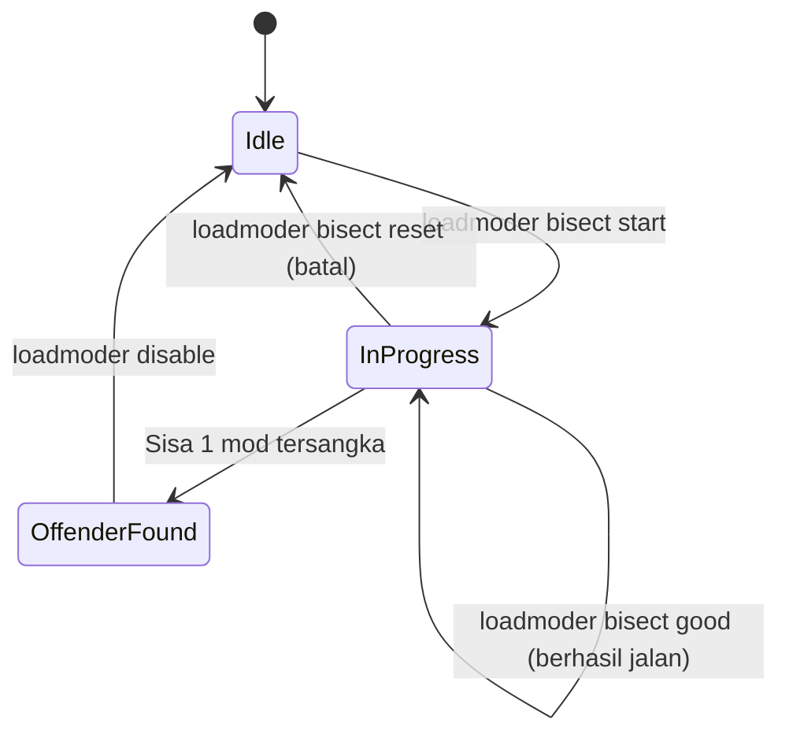

# 07 — Diagnostik Crash & Bisect Engine

Dokumen ini mendokumentasikan alat pemecahan masalah (*troubleshooting*) bawaan **LoadModer**, mekanisme penonaktifan mod instan via ekstensi `.disabled`, serta algoritma pencarian biner (**Automated Mod Bisect**) untuk mengisolasi mod penyebab crash.

---

## 1. Mekanisme Mod Disabler (`.jar.disabled`)

Semua mod loader (Fabric, Forge, NeoForge, Quilt) memindai folder `mods/` hanya untuk berkas yang berakhiran `.jar`. Berkas dengan ekstensi lain akan dilewati sepenuhnya.

LoadModer memanfaatkan karakteristik ini untuk mengaktifkan atau menonaktifkan mod **secara instan tanpa menghapus file dari disk**:
* `loadmoder disable optifabric` $\rightarrow$ mengubah `optifabric-1.14.0.jar` menjadi `optifabric-1.14.0.jar.disabled`.
* `loadmoder enable optifabric` $\rightarrow$ mengembalikan nama file ke `optifabric-1.14.0.jar`.

---

## 2. Mengapa Butuh Automated Mod Bisect?

Ketika sebuah modpack berisi 100+ mod dan game tiba-tiba mengalami crash saat peluncuran:
* Mencopot satu per satu mod memakan waktu berjam-jam ($O(N)$ pengujian).
* Menghapus semua mod menghilangkan seluruh progres konfigurasi.

**LoadModer Bisect** menggunakan algoritma **Pencarian Biner (Binary Search)**:
$$\text{Langkah Maksimal} = \lceil \log_2(N) \rceil$$

| Jumlah Mod Terpasang | Waktu Uji Manual ($O(N)$) | Waktu Uji Bisect LoadModer ($O(\log_2 N)$) |
| :---: | :---: | :---: |
| 32 Mod | 32 kali buka game | **5 kali buka game** |
| 64 Mod | 64 kali buka game | **6 kali buka game** |
| 128 Mod | 128 kali buka game | **7 kali buka game** |

---

## 3. Alur Status (State Machine) Bisect



### Skenario Penggunaan Nyata:
1. Pengguna mengetik `loadmoder bisect start`:
   - LoadModer mencatat daftar seluruh 60 mod aktif.
   - LoadModer mengubah 30 mod menjadi `.jar.disabled`.
   - Menginstruksikan pengguna untuk membuka Minecraft.
2. Jika Minecraft **berhasil masuk ke menu utama**:
   - Pengguna mengetik `loadmoder bisect good`.
   - LoadModer tahu bahwa mod penyebab crash berada di kelompok 30 mod yang sedang dinonaktifkan.
3. Jika Minecraft **tetap crash**:
   - Pengguna mengetik `loadmoder bisect bad`.
   - LoadModer tahu mod penyebab crash berada di kelompok 30 mod yang sedang aktif.
4. LoadModer membagi lagi kelompok tersangka menjadi 15 mod, lalu 7, lalu 3, lalu 1.
5. Dalam 6 langkah, LoadModer menampilkan hasil:
   `"🎯 Ditemukan! Mod penyebab crash adalah: [rubidium-mc1.21.jar]"`.

---

## 4. Implementasi Modul Bisect (`src/core/bisectEngine.ts`)

```typescript
import path from 'node:path';
import { readdir, rename, readFile } from 'node:fs/promises';
import writeFileAtomic from 'write-file-atomic';

interface BisectState {
  activeCandidates: string[];
  currentTestGroup: string[];
  step: number;
}

export class BisectEngine {
  private readonly stateFile: string;

  constructor(private readonly modsDir: string) {
    this.stateFile = path.join(modsDir, '.loadmoder_bisect.json');
  }

  async start(): Promise<{ totalMods: number; testingCount: number }> {
    const files = await readdir(this.modsDir);
    const activeMods = files.filter((f) => f.endsWith('.jar'));

    if (activeMods.length < 2) {
      throw new Error('Minimal harus ada 2 mod aktif untuk memulai sesi bisect.');
    }

    const midpoint = Math.ceil(activeMods.length / 2);
    const toDisable = activeMods.slice(0, midpoint);

    // Nonaktifkan 50% kandidat pertama
    for (const file of toDisable) {
      await rename(path.join(this.modsDir, file), path.join(this.modsDir, `${file}.disabled`));
    }

    const state: BisectState = {
      activeCandidates: activeMods,
      currentTestGroup: toDisable,
      step: 1,
    };
    await writeFileAtomic(this.stateFile, JSON.stringify(state, null, 2), 'utf8');

    return { totalMods: activeMods.length, testingCount: toDisable.length };
  }

  async report(status: 'good' | 'bad'): Promise<{ finished: boolean; culprit?: string; remaining: number }> {
    let state: BisectState;
    try {
      state = JSON.parse(await readFile(this.stateFile, 'utf8'));
    } catch {
      throw new Error('Tidak ada sesi bisect yang sedang berjalan. Mulai dengan: loadmoder bisect start');
    }

    let candidates: string[];

    if (status === 'good') {
      // Jika game berhasil jalan, berarti penyebab crash ada di kelompok yang sedang dimatikan
      candidates = state.currentTestGroup;
    } else {
      // Jika masih crash, penyebabnya ada di kelompok yang saat ini masih menyala
      candidates = state.activeCandidates.filter((f) => !state.currentTestGroup.includes(f));
    }

    if (candidates.length <= 1) {
      const culprit = candidates[0];
      await this.reset();
      return { finished: true, culprit, remaining: 1 };
    }

    // Siapkan putaran uji berikutnya (bagi dua lagi)
    await this.resetFiles();
    const midpoint = Math.ceil(candidates.length / 2);
    const nextDisable = candidates.slice(0, midpoint);

    for (const file of nextDisable) {
      await rename(path.join(this.modsDir, file), path.join(this.modsDir, `${file}.disabled`));
    }

    state.activeCandidates = candidates;
    state.currentTestGroup = nextDisable;
    state.step++;
    await writeFileAtomic(this.stateFile, JSON.stringify(state, null, 2), 'utf8');

    return { finished: false, remaining: candidates.length };
  }

  async reset(): Promise<void> {
    await this.resetFiles();
    try {
      const { rm } = await import('node:fs/promises');
      await rm(this.stateFile, { force: true });
    } catch {}
  }

  private async resetFiles(): Promise<void> {
    const files = await readdir(this.modsDir);
    for (const f of files) {
      if (f.endsWith('.jar.disabled')) {
        await rename(path.join(this.modsDir, f), path.join(this.modsDir, f.replace(/\.disabled$/, '')));
      }
    }
  }
}
```

---

## 5. Pemindaian Otomatis Crash Log (`src/core/logScanner.ts`)

Selain bisect manual, LoadModer dapat memindai berkas `logs/latest.log` atau `crash-reports/crash-*.txt` terbaru untuk mendeteksi penyebab umum crash secara instan:
* **Missing Dependency**: Pola pesan `Mod 'xyz' requires 'fabric-api'`. LoadModer langsung menawarkan: *"Apakah Anda ingin memasang fabric-api sekarang? [Y/n]"*.
* **Mixin Conflict**: Pola `org.spongepowered.asm.mixin.transformer.throwables.MixinTransformerError`.
* **Outdated Java**: Pesan `has been compiled by a more recent version of the Java Runtime (class file version 65.0)`. Memberi tahu pemain untuk menggunakan Java 21.
