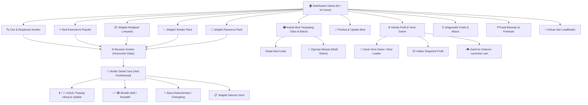

# 09 — Spesifikasi Desain UI/UX LoadModer (Nordic Clean TUI)

Dokumen ini mendokumentasikan spesifikasi tunggal (*single source of truth*) arsitektur antarmuka pengguna (UI), pengalaman pengguna (UX), token desain, serta panduan aksesibilitas untuk **LoadModer**.

---

## 1. Filosofi & Identitas Desain

LoadModer menggunakan bahasa visual **Nordic Clean TUI** yang dirancang untuk terminal modern:
- **Ketajaman Informasi (*High-Density & Clean*):** Mengutamakan keterbacaan data teknis mod (versi, loader, ukuran berkas, status dependensi, kecocokan profil).
- **Disiplin Palet Nordik:** Menggunakan warna-warna dingin terinspirasi lanskap Nordik (es, mint, lavender, slate) dengan rasio kontras tinggi ($\ge 4.5:1$ sesuai WCAG 2.2 AA).
- **Efisiensi Navigasi Keyboard:** 100% berbasis keyboard (`↑↓ / jk`, `Enter`, `Ctrl+C / Esc`) tanpa ketergantungan pada mouse.
- **Pembersihan Bersih (Clean Slate Transitions):** Menghapus seluruh layar dan riwayat buffer secara terkontrol pada tiap pergantian layar untuk mencegah penumpukan artefak visual.
- **Bukan Hanya Warna (*Dual-Indicator*):** Warna tidak pernah menjadi satu-satunya pembeda status. Selalu disertai simbol/ikon teks eksplisit (`✔`, `○`, `🌐`, `●`, `▲`, `✖`).

---

## 2. Palet Warna & Token Tema (`src/ui/theme.ts`)

LoadModer mendukung adaptasi otomatis latar belakang terminal (*Dark Mode* dan *Light Mode*), pemenuhan standar `NO_COLOR`, serta mode aksesibilitas (`ACCESSIBLE=true`).

### 2.1 Dark Mode Palette (Default)

| Token | Warna Hex | Deskripsi & Peran Visual | Kontras vs Hitam (`#000000`) |
| :--- | :--- | :--- | :--- |
| `primary` | `#38bdf8` | Frost Ice Blue — Fokus kursor `❯`, header utama, aksi penting | **10.6:1** |
| `secondary` | `#818cf8` | Soft Lavender Indigo — Judul kategori, separator section | **6.6:1** |
| `success` | `#34d399` | Nordic Mint Green — Status terpasang & aktif (`✔`), berhasil | **11.8:1** |
| `warning` | `#fbbf24` | Amber Warm Gold — Notifikasi pembaruan, status nonaktif (`○`) | **12.6:1** |
| `error` | `#f87171` | Soft Coral Rose — Pesan kegagalan, inkompatibilitas (`✖`) | **7.2:1** |
| `info` | `#67e8f9` | Polar Cyan — Metadata pendukung, ukuran berkas, URL | **15.0:1** |
| `text` | `#f1f5f9` | Light Slate Text — Teks label utama | **19.0:1** |
| `textMuted` | `#94a3b8` | Slate Gray — Sub-label keterangan, teks informatif sekunder | **8.2:1** |
| `muted` | `#94a3b8` | Slate 400 — Garis pemisah, footer bantuan | **8.2:1** |
| `border` | `#334155` | Slate 700 — Bingkai kotak status dan kartu boxen | *Batas visual struktural* |
| `activeBg` | `#1e293b` | Slate 800 — Latar belakang highlight baris terpilih | *Highlight kursor* |
| `chipBg` | `#1e293b` | Slate 800 — Latar belakang filter chip | *Chip pasif* |
| `chipActive` | `#0c4a6e` | Ocean Dark Blue — Latar belakang chip filter aktif | *Chip aktif* |

### 2.2 Light Mode Palette (Otomatis saat background terang / `COLORFGBG`)

| Token | Warna Hex | Deskripsi & Peran Visual | Kontras vs Putih (`#ffffff`) |
| :--- | :--- | :--- | :--- |
| `primary` | `#0369a1` | Sky 700 — Fokus kursor dan aksi utama | **5.9:1** |
| `secondary` | `#4338ca` | Indigo 700 — Judul dan aksen navigasi | **7.9:1** |
| `success` | `#047857` | Emerald 700 — Status aktif dan terpasang | **5.5:1** |
| `warning` | `#92400e` | Amber 800 — Peringatan dan info pembaruan | **7.1:1** |
| `error` | `#b91c1c` | Red 700 — Pesan error dan penolakan | **6.5:1** |
| `info` | `#0e7490` | Cyan 700 — Metadata teknis | **5.4:1** |
| `text` | `#0f172a` | Slate 900 — Teks utama | **17.8:1** |
| `textMuted` | `#334155` | Slate 700 — Keterangan sekunder | **10.3:1** |
| `muted` | `#475569` | Slate 600 — Garis dan footer | **7.6:1** |
| `border` | `#64748b` | Slate 500 — Garis batas | **4.8:1** |
| `activeBg` | `#e2e8f0` | Slate 200 — Highlight baris | - |
| `chipBg` | `#e2e8f0` | Slate 200 — Latar belakang chip | - |
| `chipActive` | `#bae6fd` | Sky 200 — Chip filter aktif | - |

---

## 3. Komponen Antarmuka Terminal

### 3.1 Adaptive Command Center Header (`src/ui/theme.ts`)
Dashboard utama menggunakan kombinasi harmonis banner Figlet ASCII dengan **Nordic Cyber Minimalist Status Box** (maksimal 4 baris tinggi):

```text
  ██╗      ██████╗  █████╗ ██████╗ ███╗   ███╗ ██████╗ ██████╗ ███████╗██████╗
  ██║     ██╔═══██╗██╔══██╗██╔══██╗████╗ ████║██╔═══██╗██╔══██╗██╔════╝██╔══██╗
  ██║     ██║   ██║███████║██║  ██║██╔████╔██║██║   ██║██║  ██║█████╗  ██████╔╝
  ██║     ██║   ██║██╔══██║██║  ██║██║╚██╔╝██║██║   ██║██║  ██║██╔══╝  ██╔══██╗
  ███████╗╚██████╔╝██║  ██║██████╔╝██║ ╚═╝ ██║╚██████╔╝██████╔╝███████╗██║  ██║
  ╚══════╝ ╚═════╝ ╚═╝  ╚═╝╚═════╝ ╚═╝     ╚═╝ ╚═════╝ ╚═════╝ ╚══════╝╚═╝  ╚═╝

  v2.0.0  •  Minecraft Mod & Modpack Manager  •  Nordic Clean TUI

╭  ❖ STATUS INSTANCE  ─────────────────────────────────────────────────────╮
│  Instance : Official Minecraft (Default)   •   Loader : FABRIC 1.21.1    │
│  Mods     : 31 Aktif / 31 Total   •   Storage : 53.7 MB   •   ● Siap     │
╰──────────────────────────────────────────────────────────────────────────╯
```

Pada sub-halaman (Browser, Manager, Detail, Profil), sistem otomatis beralih ke **Compact Header (1 Baris)** untuk menghemat ruang vertikal:
```text
 LOADMODER  v2.0.0 • [Official Minecraft (Default)] • FABRIC 1.21.1
```

### 3.2 Live Badges pada Menu Navigasi Utama (`src/ui/dashboard/home.ts`)
Item menu utama dilengkapi dengan indikator badge dinamis yang mencerminkan status instans:
- `🔄  Periksa & Update Mod` `[2 update rilis]` *(Warna Amber)*
- `🗃️   Kelola Mod Terpasang` `[31 mod]` *(Warna Mint Green)*
- `🩺  Diagnostik Crash & Bisect Tool` `[Sesi Berjalan]` *(Warna Cyan jika bisect aktif)*

### 3.3 Horizontal Filter Chips di Browser (`src/ui/dashboard/browser.ts`)
Menggantikan tabel filter vertikal 8 baris dengan chip bar 2 baris terpadu:
```text
╭  ❖ FILTER AKTIF & HASIL  ────────────────────────────────────────────────╮
│  [Mod]  [FABRIC]  [1.21.1]  [Semua Kategori]  •  [Urut: Relevansi]        │
│  Jelajahi Semua  •  Total: 138 hasil  •  Halaman: 1/14                   │
╰──────────────────────────────────────────────────────────────────────────╯
```

Hasil pencarian mod menyertakan validasi status instalasi instan (`✔` dan badge `[Terpasang]` / `[Nonaktif]`):
```text
? EKSPLORASI MOD (Halaman 1/14 • 138 Hasil)
❯ ✔ Sodium [sodium]                                        [Terpasang]
    ⬇ 34.2M  •  Optimization  •  jellysquid3_
  ✔ Iris Shaders [iris]                                    [Nonaktif]
    ⬇ 22.1M  •  Shaders  •  coderbot
    Lithium [lithium]
    ⬇ 18.7M  •  Optimization  •  jellysquid3_
```

### 3.4 Mod Manager: Segmented Tabs & Batch Operations (`src/ui/dashboard/manager.ts`)
- **Storage Gauge:** Menampilkan kapasitas penyimpanan mod terpakai dan jumlah total berkas.
- **Segmented Tabs:**
  - `[1] ● Semua Mod (31)`
  - `[2] ✔ Aktif (28)`
  - `[3] ○ Nonaktif (3)`
- **Aksi Massal (*Batch Operations*):** Memungkinkan pengguna memilih beberapa mod sekaligus melalui multi-select prompt untuk diaktifkan, dinonaktifkan, atau dihapus dalam satu operasi.

### 3.5 Nordic Detail Card (`src/ui/dashboard/detailCard.ts` & `detailLoader.ts`)
Kartu rincian mod dengan penyelarasan rapi *key-value* dan integrasi status terpasang otomatis:
```text
╭  ❖ SODIUM [sodium]  ─────────────────────────────────────────────────────╮
│  Status    : ✔ Terpasang (Aktif)   •   Versi : v0.5.8 (Terkini)  •  1.1 MB │
│  Kesesuaian: ✔ Cocok [FABRIC 1.20.1] → Rilis v0.5.8                      │
│  Statistik : ⬇ 34,250,120 unduhan   •   ⭐ 45,210 pengikut  •  LGPL-3.0   │
│  Library   : fabric-api (Auto-install)                                   │
│  Deskripsi : Modern rendering engine and client-side optimization for... │
╰──────────────────────────────────────────────────────────────────────────╯
```

**Status Badge yang Didukung:**
- `✔ Terpasang (Aktif)` *(Nordic Mint Green)*
- `○ Terpasang (Nonaktif)` *(Warm Amber Gold)*
- `🌐 Belum Terpasang (Modrinth)` *(Polar Cyan)*

### 3.6 Paginated Markdown Viewer (`src/ui/markdownViewer.ts`)
- Menampilkan deskripsi lengkap (Modrinth body) dan catatan rilis (changelog).
- Mendukung pemotongan per halaman (default 18 baris) dengan hotkey `n` (berikutnya), `p` (sebelumnya), `q` (keluar).
- Header bergaya Nordic dengan batas visual terpadu.

---

## 4. Struktur Navigasi & Arsitektur Alur



---

## 5. Sistem Interaksi & Hotkey Global

| Tombol | Fungsi |
| :--- | :--- |
| `↑↓` / `j k` | Menggeser kursor pilihan |
| `Enter` | Memilih / membuka aksi |
| `Ctrl+C` / `Esc` | Batal / kembali satu tingkat menu secara aman (*graceful back*) |
| `Space` | Menandai / mencentang item pada menu pilihan ganda (*batch multi-select*) |
| `a` | Memilih semua item (*select all*) pada menu multi-select |
| `n` / `p` | Halaman berikutnya (*next*) / sebelumnya (*prev*) pada Markdown Viewer |
| `q` | Keluar dari Markdown Viewer |

---

## 6. Aksesibilitas & Kompatibilitas Lingkungan

1. **Standar Kontras WCAG 2.2 AA:** Seluruh kombinasi token teks dan latar belakang wajib memiliki rasio kontras $\ge 4.5:1$ (divalidasi otomatis pada `tests/uiThemeA11y.test.ts`).
2. **Mode Aksesibilitas (`ACCESSIBLE=true`):**
   - Menonaktifkan animasi terminal.
   - Menggunakan banner teks satu baris tanpa seni Figlet ASCII.
   - Mempertahankan riwayat *scrollback* buffer terminal saat berganti halaman.
3. **Standar `NO_COLOR` (https://no-color.org):**
   - Menghormati variabel lingkungan `NO_COLOR`.
   - Output terminal bersih tanpa ANSI escape sequences saat digunakan dalam skrip atau lingkungan CI.
4. **Output CLI Terprogram (`--json`):**
   - Seluruh perintah CLI (`search`, `list`, `profile`, `config`) menyediakan flag `--json` untuk mengeluarkan objek JSON murni tanpa dekorasi terminal.

---

## 7. Riwayat Implementasi Redesain (5 Fase Selesai)

| Fase | Cakupan Pekerjaan | Status |
| :--- | :--- | :--- |
| **Fase 1** | Adaptive Figlet ASCII + 4-line Nordic Cyber Status Box & Live Badges | **Selesai (Completed)** |
| **Fase 2** | Horizontal Filter Chips Bar & Hasil Pencarian Ringkas di Browser | **Selesai (Completed)** |
| **Fase 3** | Mod Manager dengan Segmented Tabs, Storage Gauge & Bulk Operations | **Selesai (Completed)** |
| **Fase 4** | Key-Value Nordic Detail Card & Deteksi Status Terpasang Cerdas | **Selesai (Completed)** |
| **Fase 5** | Final Polish, Aksesibilitas WCAG AA & NO_COLOR, serta E2E Verification | **Selesai (Completed)** |

Seluruh implementasi di atas telah terverifikasi melalui 20 berkas pengujian unit, integrasi, dan E2E (`npm test` 138/138 lulus) serta kompilasi bundel produksi (`npm run build`).
