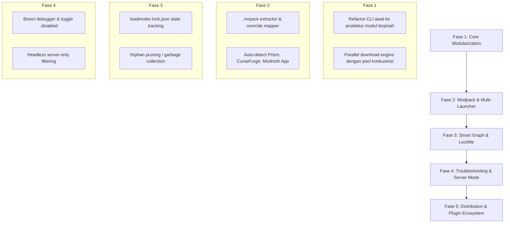

# LoadModer — Cetak Biru Arsitektur Platform CLI Mod & Modpack Manager Minecraft

Dokumen ini merupakan ekspansi arsitektural menyeluruh dari fondasi yang telah diuraikan pada `modrinth-cli-guide.md`. Panduan sebelumnya berfokus pada utilitas CLI dasar untuk file `.jar` tunggal; dokumen ini memperluas konsep tersebut menjadi **sebuah platform modding berbasis Command Line (CLI/CMD) kelas produksi bernama LoadModer**.

---

## 1. Visi Platform: Dari Script Sederhana Menuju "NPM / Cargo"-nya Minecraft

Platform modding CLI modern tidak boleh hanya sekadar "downloader file `.jar`". LoadModer dirancang untuk memberikan pengalaman selayaknya package manager modern (`npm`, `cargo`, `pip`) yang langsung terintegrasi dengan ekosistem Minecraft:

```
┌────────────────────────────────────────────────────────────────────────┐
│                          LOADMODER CLI CORE                            │
├─────────────────┬────────────────────┬─────────────────┬───────────────┤
│  Asset Router   │  Modpack Engine    │ Dependency DAG  │ Auto-Detector │
│  (Mod/Shader/RP)│  (.mrpack unpack)  │ & Lockfile      │ Multi-Launcher│
├─────────────────┴────────────────────┴─────────────────┴───────────────┤
│                   High-Concurrency Pipeline & Cache                    │
├────────────────────────────────────────────────────────────────────────┤
│                       Modrinth API (Labrinth v2)                       │
└────────────────────────────────────────────────────────────────────────┘
```

### Kesenjangan Antara Panduan Awal vs Kebutuhan Platform

| Fitur / Dimensi | `modrinth-cli-guide.md` (Awal) | LoadModer Platform (Ekspansi Baru) |
| :--- | :--- | :--- |
| **Cakupan Proyek** | Mod `.jar` saja | Mod, Modpack (`.mrpack`), Resource Pack, Shaders, Datapack |
| **Deteksi Folder** | Hanya `%APPDATA%\.minecraft\mods` | Auto-detect Prism, CurseForge, Modrinth App, MultiMC, Vanilla |
| **Manajemen State** | Stateless (hanya hash file) | Hybrid: Lockfile (`loadmoder.lock.json`) + Verifikasi Hash Fisik |
| **Penanganan Dependensi**| Pasang rekursif tanpa pelacakan | Directed Acyclic Graph (DAG) + Garbage Collection / Orphan Pruning |
| **Instalasi Modpack** | Belum ada | Full `.mrpack` unpacking, index parsing, overrides, env filter |
| **Troubleshooting** | Manual (hapus file) | Mod Bisect (pencarian biner mod penyebab crash) & Toggle (`.disabled`) |
| **Dukungan Server** | Client-centric | Headless Server Mode (otomatis memfilter mod client-only) |
| **Kecepatan Unduh** | Sequential (satu per satu) | Parallel worker pool (3-5 konkurensi) + resume unduhan terputus |

---

## 2. Tujuh Pilar Pengembangan Platform LoadModer

### Pilar 1: Mesin Modpack Penuh (`.mrpack` Engine)
Format modpack standar Modrinth adalah `.mrpack` (arsip ZIP terstruktur). LoadModer mengintegrasikan mesin unpacking yang mampu:
1. **Membaca Manifest `modrinth.index.json`**:
   - Memvalidasi versi game dan loader (`dependencies.minecraft`, `dependencies.fabric-loader` / `forge`).
   - Memetakan daftar berkas ke lokasi tujuan (`path`, misal `mods/sodium-1.21.jar`, `config/options.txt`).
   - Memfilter berdasarkan target environment (`env.client` vs `env.server`).
2. **Memproses Overrides**:
   - Menyalin folder `overrides/` langsung ke root instance Minecraft.
   - Menyalin `client-overrides/` hanya jika target instalasi adalah client.
   - Menyalin `server-overrides/` jika target adalah dedicated server.
3. **Atomic Unpack & Rollback**:
   Jika unduhan modpack gagal di tengah jalan, seluruh berkas sementara dibatalkan tanpa merusak folder game yang ada.

### Pilar 2: Auto-Discovery & Integrasi Multi-Launcher
Pengguna Minecraft modern jarang menggunakan folder `.minecraft` default. Mereka menggunakan launcher dengan konsep *instance/profile*. LoadModer secara otomatis mendeteksi:

1. **Prism Launcher / MultiMC**:
   - Path Windows: `%APPDATA%\PrismLauncher\instances\`
   - Path Linux: `~/.local/share/PrismLauncher/instances/`
   - Membaca `instance.cfg` (nama instance) dan `mmc-pack.json` (versi MC + loader yang terpasang).
2. **Modrinth App (Theseus)**:
   - Path: `%APPDATA%\com.modrinth.theseus\profiles\`
   - Membaca `profile.json` untuk mengetahui metadata versi secara instan.
3. **CurseForge App**:
   - Path: `%USERPROFILE%\curseforge\minecraft\Instances\`
   - Membaca `minecraftinstance.json`.
4. **Official Launcher**:
   - Membaca `.minecraft/launcher_profiles.json`.

> **Hasil**: Pengguna cukup menjalankan `loadmoder init` atau memilih via prompt interaktif:
> ```text
> ? Pilih Target Minecraft Instance:
> ❯ [Prism] 1.21.1-Fabric-SMP (D:\Games\Prism\instances\1.21.1-Fabric-SMP)
>   [Modrinth] Cobblemon-Pack (C:\Users\...\com.modrinth.theseus\profiles\Cobblemon)
>   [Vanilla] Default (.minecraft)
> ```
> Versi game, mod loader, dan path folder otomatis terisi tanpa konfigurasi manual!

### Pilar 3: Unified Multi-Asset Routing
Satu perintah untuk semua tipe konten Modrinth dengan perutean direktori otomatis:
* **Mod (`project_type: mod`)** → `mods/*.jar`
* **Resource Pack (`project_type: resourcepack`)** → `resourcepacks/*.zip`
* **Shader Pack (`project_type: shader`)** → `shaderpacks/*.zip` (dengan peringatan cerdas jika mod shader seperti Iris/Oculus belum ada)
* **Data Pack (`project_type: datapack`)** → `saves/<world_name>/datapacks/*.zip`

### Pilar 4: Dependency Graph & Orphan Pruning (Garbage Collection)
Masalah terbesar mod manager konvensional adalah berkas dependensi yang tertinggal (orphan) saat mod induk dihapus. LoadModer mengatasinya dengan **Dependency Reference Counting** melalui `loadmoder.lock.json`:
* Setiap mod yang diinstal manual dicatat sebagai `root: true`.
* Setiap dependensi otomatis dicatat dengan daftar `dependedBy: ["mod-a", "mod-b"]`.
* Saat `loadmoder remove mod-a` dijalankan:
  1. `mod-a` dihapus dari `dependedBy` mod dependensinya.
  2. Jika ada dependensi yang nilai `dependedBy`-nya menjadi kosong (0 referensi), CLI akan bertanya:
     `"Dependensi [cloth-config] tidak lagi digunakan oleh mod lain. Hapus berkas ini? (Y/n)"`.

### Pilar 5: Crash Isolation & Diagnostic Tools (Bisect & Toggle)
Mod Minecraft rentan crash dan konflik. LoadModer menyediakan sub-sistem diagnostik:
1. **Mod Toggle (`enable` / `disable`)**:
   Mengubah nama `mod.jar` menjadi `mod.jar.disabled` secara instan tanpa menghapus berkas. Minecraft mengabaikan berkas non-`.jar`.
2. **Automated Mod Bisect (`loadmoder bisect`)**:
   Ketika game crash tetapi pemain tidak tahu mod mana yang rusak:
   - CLI mematikan 50% mod.
   - Pemain meluncurkan game dan mengonfirmasi apakah masih crash (`loadmoder bisect bad` / `loadmoder bisect good`).
   - Algoritma pencarian biner mengisolasi mod penyebab crash hanya dalam 5-7 kali pengujian dari total 100+ mod.

### Pilar 6: Headless Dedicated Server Support
Sangat cocok untuk sysadmin yang mengelola server Minecraft via SSH / CMD:
* Flag `--env server` menyaring data dari `files[].env` atau manifest modpack.
* Mengabaikan mod client-only (misal: Sodium, Iris, FreeCam, AppleSkin, Presence Footsteps).
* Mencegah crash umum `NoClassDefFoundError: net/minecraft/client/...` saat menjalankan server Forge/Fabric.

### Pilar 7: High-Concurrency Download Engine & Interactive TUI (Anichi-Style UX)
* **Parallel Worker Pool**: Mengunduh 3-5 file secara bersamaan dengan pembatas laju HTTP (`p-limit`), aman dari batas rate limit 300 req/menit Modrinth API.
* **Resume Support**: Menggunakan HTTP Header `Range: bytes=X-` untuk melanjutkan unduhan modpack besar jika koneksi terputus.
* **Interactive TUI Dashboard (Gaya Anichi-CLI)**: 
  - Banner raksasa `figlet` (ANSI Shadow) dengan gradasi neon cyan-pink (`gradient-string`).
  - Navigasi keyboard raw mode ($\uparrow/\downarrow$/Enter) dengan active line background highlight `#0f172a` dan pointer `❯`.
  - Peluncuran otomatis menu utama jika perintah dipanggil tanpa argumen (`loadmoder` atau `lm`).
  - Kotak informasi dan metadata mod berbingkai bulat (`boxen`).

---

## 3. Hierarki Perintah LoadModer CLI (Alias: `lm`)

```text
loadmoder (atau alias: lm)
├── [tanpa argumen]      # Otomatis meluncurkan Dashboard Interaktif TUI (Home Menu)
├── home                 # Buka antarmuka interaktif dashboard utama
├── init                 # Wizard interaktif deteksi launcher & pemilihan instance
├── search <query>       # Pencarian universal (mod, pack, shader, resourcepack)
├── install <slug/url>   # Instalasi mod tunggal, URL Modrinth, atau modpack .mrpack
│   ├── --type <asset>   # mod | modpack | shader | resourcepack
│   ├── --env <target>   # client (default) | server
│   ├── --profile <name> # Target instance spesifik
│   └── --dry-run        # Simulasi instalasi tanpa mengunduh
├── update               # Cek & pembaruan massal versi mod yang kompatibel
├── remove <name>        # Hapus mod beserta pembersihan dependensi yatim (prune)
├── list                 # Daftar aset terpasang, status dependensi, dan integritas hash
├── disable <name>       # Matikan mod (.jar -> .jar.disabled)
├── enable <name>        # Aktifkan kembali mod (.jar.disabled -> .jar)
├── bisect               # Wizard pencarian biner isolasi mod penyebab crash
│   ├── start
│   ├── good
│   ├── bad
│   └── reset
├── export               # Ekspor state instance ke format .mrpack atau manifest JSON
├── sync                 # Replikasi identik dari file lockfile / manifest
└── config               # Pengaturan global & manajemen profil instance
```

---

## 4. Arsitektur Data: `loadmoder.lock.json`

File kunci ini disimpan langsung di folder root instance Minecraft atau folder mods untuk memastikan integritas dan portabilitas:

```json
{
  "$schema": "https://loadmoder.dev/schema/v1/lock.json",
  "version": 1,
  "gameVersion": "1.21.1",
  "loader": "fabric",
  "environment": "client",
  "updatedAt": "2026-09-30T14:00:00Z",
  "mods": {
    "sodium": {
      "projectId": "AANobbMI",
      "versionId": "f90B2c1A",
      "versionNumber": "mc1.21.1-0.6.0",
      "filename": "sodium-fabric-0.6.0+mc1.21.1.jar",
      "sha512": "3a8f...b291",
      "isRoot": true,
      "installedAt": "2026-09-30T12:00:00Z"
    },
    "fabric-api": {
      "projectId": "P7dR8mSH",
      "versionId": "hJ98aK2L",
      "versionNumber": "0.102.0+1.21.1",
      "filename": "fabric-api-0.102.0+1.21.1.jar",
      "sha512": "9e12...a04c",
      "isRoot": false,
      "dependedBy": ["sodium", "iris"],
      "installedAt": "2026-09-30T12:00:00Z"
    }
  },
  "resourcepacks": {},
  "shaderpacks": {}
}
```

---

## 5. Implementasi Teknis Modul Kunci

Berikut adalah arsitektur implementasi komponen penting yang melengkapi kode dasar di `modrinth-cli-guide.md`.

### A. Modpack Unpacker & Installer (`src/core/modpack.ts`)
```typescript
import path from 'node:path';
import { createWriteStream } from 'node:fs';
import { mkdir, rm } from 'node:fs/promises';
import unzipper from 'unzipper'; // Stream-based zip extractor
import type { ModrinthClient } from './modrinth.js';
import { hashFile } from './utils.js';

export interface MrpackIndexFile {
  path: string;
  hashes: { sha1: string; sha512: string };
  env?: {
    client: 'required' | 'optional' | 'unsupported';
    server: 'required' | 'optional' | 'unsupported';
  };
  downloads: string[];
  fileSize: number;
}

export interface MrpackIndex {
  formatVersion: number;
  game: 'minecraft';
  versionId: string;
  name: string;
  summary?: string;
  files: MrpackIndexFile[];
  dependencies: {
    minecraft: string;
    [loader: string]: string;
  };
}

export class ModpackInstaller {
  constructor(
    private readonly api: ModrinthClient,
    private readonly instanceDir: string,
    private readonly targetEnv: 'client' | 'server' = 'client'
  ) {}

  async installFromMrpackFile(mrpackPath: string): Promise<void> {
    console.log(`📦 Mengekstrak berkas modpack: ${path.basename(mrpackPath)}`);
    const directory = await unzipper.Open.file(mrpackPath);

    // 1. Ambil & parse modrinth.index.json
    const indexEntry = directory.files.find((f) => f.path === 'modrinth.index.json');
    if (!indexEntry) throw new Error('Berkas .mrpack tidak valid: modrinth.index.json tidak ditemukan.');

    const indexContent = (await indexEntry.buffer()).toString('utf8');
    const index: MrpackIndex = JSON.parse(indexContent);
    console.log(`✨ Modpack: ${index.name} (${index.versionId}) untuk MC ${index.dependencies.minecraft}`);

    // 2. Ekstrak overrides folder (konfigurasi, resourcepack, script)
    for (const file of directory.files) {
      if (file.path.startsWith('overrides/')) {
        const relPath = file.path.replace(/^overrides\//, '');
        if (!relPath) continue;
        const dest = path.join(this.instanceDir, relPath);
        if (file.type === 'Directory') {
          await mkdir(dest, { recursive: true });
        } else {
          await mkdir(path.dirname(dest), { recursive: true });
          file.stream().pipe(createWriteStream(dest));
        }
      }
      // Ekstrak environment-specific overrides
      if (this.targetEnv === 'client' && file.path.startsWith('client-overrides/')) {
        const relPath = file.path.replace(/^client-overrides\//, '');
        const dest = path.join(this.instanceDir, relPath);
        if (file.type !== 'Directory') {
          await mkdir(path.dirname(dest), { recursive: true });
          file.stream().pipe(createWriteStream(dest));
        }
      }
    }

    // 3. Unduh semua berkas modrinth yang dideklarasikan di index
    console.log(`⬇️  Mengunduh ${index.files.length} berkas modpack...`);
    for (const modFile of index.files) {
      // Periksa filter environment
      if (this.targetEnv === 'server' && modFile.env?.server === 'unsupported') continue;
      if (this.targetEnv === 'client' && modFile.env?.client === 'unsupported') continue;

      const destPath = path.join(this.instanceDir, modFile.path);
      const downloadUrl = modFile.downloads[0];
      if (!downloadUrl) continue;

      await this.api.download(downloadUrl, destPath, {
        sha512: modFile.hashes.sha512,
        size: modFile.fileSize,
      });
      console.log(`  ✔ [OK] ${modFile.path}`);
    }

    console.log(`🎉 Modpack "${index.name}" berhasil dipasang ke: ${this.instanceDir}`);
  }
}
```

---

### B. Auto-Detector Launcher & Profil Instance (`src/core/launcherDetector.ts`)
```typescript
import os from 'node:os';
import path from 'node:path';
import { readdir, readFile } from 'node:fs/promises';

export interface MinecraftInstance {
  launcher: 'Prism' | 'Modrinth' | 'CurseForge' | 'Vanilla';
  name: string;
  rootDir: string;
  modsDir: string;
  gameVersion?: string;
  loader?: string;
}

export async function detectInstances(): Promise<MinecraftInstance[]> {
  const instances: MinecraftInstance[] = [];
  const home = os.homedir();
  const isWin = process.platform === 'win32';
  const appData = process.env.APPDATA ?? path.join(home, 'AppData', 'Roaming');

  // 1. Deteksi Prism Launcher
  const prismDir = isWin
    ? path.join(appData, 'PrismLauncher', 'instances')
    : path.join(home, '.local', 'share', 'PrismLauncher', 'instances');
  
  try {
    const dirs = await readdir(prismDir, { withFileTypes: true });
    for (const d of dirs) {
      if (d.isDirectory()) {
        const root = path.join(prismDir, d.name);
        const mmcPath = path.join(root, 'mmc-pack.json');
        let gameVersion: string | undefined;
        let loader: string | undefined;

        try {
          const mmcData = JSON.parse(await readFile(mmcPath, 'utf8'));
          const mcComp = mmcData.components?.find((c: any) => c.uid === 'net.minecraft');
          gameVersion = mcComp?.version;
          if (mmcData.components?.some((c: any) => c.uid === 'net.fabricmc.fabric-loader')) loader = 'fabric';
          else if (mmcData.components?.some((c: any) => c.uid === 'net.minecraftforge')) loader = 'forge';
          else if (mmcData.components?.some((c: any) => c.uid === 'net.neoforged')) loader = 'neoforge';
        } catch {}

        instances.push({
          launcher: 'Prism',
          name: d.name,
          rootDir: root,
          modsDir: path.join(root, '.minecraft', 'mods'),
          gameVersion,
          loader,
        });
      }
    }
  } catch {}

  // 2. Deteksi Modrinth App
  const theseusDir = isWin
    ? path.join(appData, 'com.modrinth.theseus', 'profiles')
    : path.join(home, '.config', 'ModrinthApp', 'profiles');
  
  try {
    const dirs = await readdir(theseusDir, { withFileTypes: true });
    for (const d of dirs) {
      if (d.isDirectory()) {
        const root = path.join(theseusDir, d.name);
        let gameVersion: string | undefined;
        let loader: string | undefined;
        try {
          const prof = JSON.parse(await readFile(path.join(root, 'profile.json'), 'utf8'));
          gameVersion = prof.game_version;
          loader = prof.loader;
        } catch {}

        instances.push({
          launcher: 'Modrinth',
          name: d.name,
          rootDir: root,
          modsDir: path.join(root, 'mods'),
          gameVersion,
          loader,
        });
      }
    }
  } catch {}

  // 3. Deteksi Vanilla Launcher Default
  const vanillaDir = isWin ? path.join(appData, '.minecraft') : path.join(home, '.minecraft');
  instances.push({
    launcher: 'Vanilla',
    name: 'Default Vanilla',
    rootDir: vanillaDir,
    modsDir: path.join(vanillaDir, 'mods'),
  });

  return instances;
}
```

---

### C. Mod Toggle & Troubleshooting Bisect (`src/core/troubleshoot.ts`)
```typescript
import path from 'node:path';
import { readdir, rename } from 'node:fs/promises';

export class ModTroubleshooter {
  constructor(private readonly modsDir: string) {}

  async toggleMod(modQuery: string, enable: boolean): Promise<string> {
    const files = await readdir(this.modsDir);
    const targetSuffix = enable ? '.jar.disabled' : '.jar';
    const replaceSuffix = enable ? '.jar' : '.jar.disabled';

    const match = files.find(
      (f) => f.toLowerCase().includes(modQuery.toLowerCase()) && f.endsWith(targetSuffix)
    );

    if (!match) throw new Error(`Berkas mod untuk "${modQuery}" dengan status ${enable ? 'nonaktif' : 'aktif'} tidak ditemukan.`);

    const oldPath = path.join(this.modsDir, match);
    const newName = match.replace(new RegExp(`\\${targetSuffix}$`), replaceSuffix);
    const newPath = path.join(this.modsDir, newName);

    await rename(oldPath, newPath);
    return newName;
  }

  /** Membagi kumpulan mod aktif menjadi dua bagian untuk pengujian biner (bisect) */
  async bisectPartition(step: 'first_half' | 'second_half'): Promise<{ disabledCount: number; activeCount: number }> {
    const files = await readdir(this.modsDir);
    const jars = files.filter((f) => f.endsWith('.jar') || f.endsWith('.jar.disabled'));
    const midpoint = Math.floor(jars.length / 2);

    let disabledCount = 0;
    let activeCount = 0;

    for (let i = 0; i < jars.length; i++) {
      const file = jars[i];
      const shouldDisable = step === 'first_half' ? i < midpoint : i >= midpoint;
      const currentDisabled = file.endsWith('.jar.disabled');

      if (shouldDisable && !currentDisabled) {
        await rename(path.join(this.modsDir, file), path.join(this.modsDir, `${file}.disabled`));
        disabledCount++;
      } else if (!shouldDisable && currentDisabled) {
        await rename(path.join(this.modsDir, file), path.join(this.modsDir, file.replace(/\.disabled$/, '')));
        activeCount++;
      }
    }

    return { disabledCount, activeCount };
  }
}
```

---

## 6. Integrasi UI/UX Interaktif (Terminal Visuals)

Untuk membuat LoadModer terasa selayaknya platform modern, UX CLI diperkuat dengan:
1. **Fuzzy Search & Selector**: Menampilkan daftar mod dengan preview jumlah download, author, dan deskripsi singkat.
2. **Multi-Progress Dashboard**: Saat mengunduh modpack dengan puluhan mod, menggunakan display visual multi-line progres (misal dengan `listr2` atau `cli-progress`).
3. **Pemberitahuan Kompatibilitas Instan**:
   - Jika pengguna memasang shader di lingkungan Fabric, otomatis mendeteksi ketiadaan `iris`. CLI langsung memberikan opsi:
     `"⚠️ Shader membutuhkan Iris Shaders. Apakah ingin menginstal Iris sekarang? [Y/n]"`.

---

## 7. Roadmap Implementasi LoadModer



Dengan spesifikasi ini, platform LoadModer melampaui utilitas download biasa dan menjadi manajer lingkungan Minecraft yang handal, cepat, dan sepenuhnya otomatis.
