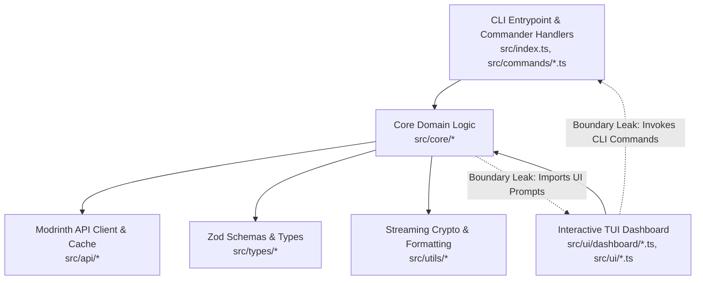

# Architecture & Code Quality Audit

**Date:** 2026-10-02  
**Repository:** [LoadModer](file:///c:/Users/DELL/Downloads/LoadModer)  
**Branch:** `main`  
**Audited Commit SHA:** `f89edbae5a66768f0de1b305f3558ec461226a96`  
**Working Tree State:** Modified (Documentation updates committed/staged)  
**Auditor:** Antigravity AI Engineering System  
**Audit Protocol:** Production-Grade Architecture & Code Quality Audit v2.0  
**Applied Skills:** `/antislop-code`, `/software-architecture`, `/code-review`, `/clean-code`

---

## 0. Audit Scope & Coverage

### Repository Snapshot

```text
Audit Date:                      2026-10-02
Repository:                      2Hafast8/LoadModer
Branch:                          main
Commit SHA:                      f89edbae5a66768f0de1b305f3558ec461226a96
Primary Stack:                   TypeScript 5.5.3 (strict), Node.js >= 20.0.0 (ESM)
CLI Framework:                   Commander.js 12.1.0
Validation:                      Zod 3.23.8
Bundler:                         tsup 8.1.0 (esbuild target node20)
Test Runner:                     Vitest 1.6.0
Project Scale:                   41 source files (6,083 LOC in src/), 6 test files (719 LOC in tests/)
Command Execution Available:     Yes (Local PowerShell 7 / Windows 11)
Network Access Available:        Restricted / Local
Audit Mode:                      Audit & Inspection Only (Zero source code modifications)
```

### Coverage Map

| Architectural Domain | Files Inspected | Review Depth | Status |
| :--- | :--- | :--- | :--- |
| **API Client & Network** | `src/api/client.ts`, `src/api/cache.ts` | 100% Full-depth | Audited |
| **Dependency Core** | `src/core/dependency/graph.ts`, `src/core/dependency/resolver.ts` | 100% Full-depth | Audited |
| **Instance & Launcher** | `src/core/instance/config.ts`, `src/core/instance/detector.ts` | 100% Full-depth | Audited |
| **Minecraft & Versions** | `src/core/minecraft/versions.ts` | 100% Full-depth | Audited |
| **Modpack Engine** | `src/core/modpack/unpacker.ts` | 100% Full-depth | Audited |
| **Profile & Isolation** | `src/core/profile/snapshotManager.ts` | 100% Full-depth | Audited |
| **Troubleshooting & Bisect**| `src/core/troubleshoot/bisect.ts` | 100% Full-depth | Audited |
| **Directory Watcher** | `src/core/watcher/modsWatcher.ts` | 100% Full-depth | Audited |
| **Type Definitions** | `src/types/*.ts` (5 files) | 100% Full-depth | Audited |
| **CLI Commands** | `src/commands/*.ts` (11 files) | 100% Full-depth | Audited |
| **TUI Dashboard** | `src/ui/dashboard/*.ts`, `src/ui/*.ts` (8 files) | 100% Full-depth | Audited |
| **Utilities** | `src/utils/*.ts` (3 files) | 100% Full-depth | Audited |
| **Test Suites** | `tests/*.test.ts` (6 files) | 100% Full-depth | Audited |

**Coverage Confidence:** **High (100% of production source files and test suites inspected)**.

---

## 1. Architecture Overview

LoadModer (`lm`) is structured as a standalone TypeScript CLI and Terminal User Interface (TUI) application designed to manage Minecraft mods, modpacks (`.mrpack`), shaders, and resource packs via the Modrinth API v2.



### Architectural Strengths
1. **Atomic Disk Operations:** Consistent application of `write-file-atomic` across configuration, lockfiles, and profile snapshots protects against corruption from unexpected termination.
2. **Download Pipeline Integrity:** Remote files stream through Node.js transform streams directly to temporary `.part` files, followed by SHA-512 checksum validation before atomic renaming.
3. **Reactive Real-Time Watcher:** `ModsWatcher` (`src/core/watcher/modsWatcher.ts`) cleanly extends Node's native `EventEmitter`, using `node:fs.watch()` with a 300ms debounce to reconcile external file system modifications without polling.
4. **DAG Reference Counting:** The dependency lockfile engine (`DependencyGraph`) tracks parent-child lineages, enabling orphan pruning when root mods are removed.
5. **Strict Type Safety:** Zero `@ts-ignore` and zero `@ts-expect-error` directives in production code; compile-time validation exits with 0 errors on strict TypeScript 5.5.

---

## 2. Architecture Findings

### [ARCH-001] Core-to-UI Domain Boundary Leakage in `src/core/dependency/resolver.ts`
- **Classification:** Confirmed Architecture Problem
- **Severity:** **HIGH**
- **Location:** [src/core/dependency/resolver.ts#L4](file:///c:/Users/DELL/Downloads/LoadModer/src/core/dependency/resolver.ts#L4), lines 235, 239, 282, 322, 345, 350, 352, 394
- **Problem:** A core domain module imports terminal prompt utilities from `src/ui/prompts.ts` and directly invokes terminal logging methods (`p.log.message`, `p.log.step`, `p.log.warn`, `p.log.info`) during dependency resolution.
- **Evidence:**
  ```typescript
  // src/core/dependency/resolver.ts:L4
  import { p, pc } from '../../ui/prompts.js';

  // src/core/dependency/resolver.ts:L235
  p.log.message(pc.dim('  ℹ️  Mod ini mandiri (tidak memerlukan library tambahan).'));

  // src/core/dependency/resolver.ts:L239
  p.log.step(`Memeriksa mod library yang dibutuhkan untuk ${pc.bold(mainModSlug)}...`);
  ```
- **Consequence:**
  - Directly violates the architectural boundary rule specified in `AGENTS.md` and `docs/01-architecture-and-vision.md` (*"Domain Decoupling: Modules in src/core/ must NEVER import UI libraries"*).
  - Causes test runner pollution: running unit tests (`npm test`) emits ANSI terminal logs into stdout during automated test execution.
  - Prevents reusing the resolver in headless environments, background workers, or future GUI frontends.
- **Impact:** Testing, Domain Isolation, Portability, Architectural Boundaries.
- **Recommendation:** Refactor `resolveAndInstallDependencies` to accept an optional logging or event callback (`onLog?: (event: ResolutionLogEvent) => void`) or return a structured resolution report object. Decouple presentation to the caller (`src/commands/install.ts`).
- **Refactoring Scope:** Small
- **Change Risk:** Low (Preserves resolution algorithm; only logging mechanics change).
- **Verification:** Unit tests execute silently without terminal log output, and CLI `lm install` still renders formatted output via command handler.

---

### [ARCH-002] Upward Layer Boundary Inversion in `src/core/minecraft/versions.ts`
- **Classification:** Confirmed Architecture Problem
- **Severity:** **MEDIUM**
- **Location:** [src/core/minecraft/versions.ts#L6](file:///c:/Users/DELL/Downloads/LoadModer/src/core/minecraft/versions.ts#L6), lines 151–184
- **Problem:** `src/core/minecraft/versions.ts` imports the UI type `InteractiveChoice` and formats UI menu labels, radio indicators (`●`), and recommendation hints inside the domain layer.
- **Evidence:**
  ```typescript
  // src/core/minecraft/versions.ts:L6
  import type { InteractiveChoice } from '../../ui/interactive.js';

  // src/core/minecraft/versions.ts:L151-L184
  export async function getMinecraftVersionChoices(
    currentVersion?: string
  ): Promise<InteractiveChoice[]> {
    ...
    choices.push({
      name: `${isCurrent ? '● ' : '○ '}Minecraft ${ver}`,
      value: ver,
      hint: tagHint || undefined,
    });
  }
  ```
- **Consequence:** Inverts layer dependency direction (`core` importing from `ui`). Formatting badges like `'Paling Populer & Stabil'` or `'Klasik Modern'` is presentation logic, not version discovery logic.
- **Impact:** Maintainability, Clean Architecture Layering.
- **Recommendation:** Move `getMinecraftVersionChoices` to `src/ui/dashboard/browser.ts` or a UI helper module. Keep `src/core/minecraft/versions.ts` focused purely on fetching version tags, disk caching, and semantic sorting (`compareMinecraftVersionsDesc`).
- **Refactoring Scope:** Small
- **Change Risk:** Low
- **Verification:** `npx tsc --noEmit` and `npm test` pass with no `InteractiveChoice` references in `src/core/`.

---

### [ARCH-003] God UI Component & Megamodule in `src/ui/dashboard/detail.ts`
- **Classification:** Confirmed Architecture Problem
- **Severity:** **HIGH**
- **Location:** [src/ui/dashboard/detail.ts#L1-L1149](file:///c:/Users/DELL/Downloads/LoadModer/src/ui/dashboard/detail.ts#L1-L1149) (1,149 LOC, 45.3 KB)
- **Problem:** A single UI module accumulates five distinct responsibilities across 1,149 lines of code:
  1. **Domain Logic:** `computeModCompatibility()` calculates version compatibility matrices against active loader/version.
  2. **Data Aggregation:** `buildInstalledModDetail()` and `buildRemoteModDetail()` query filesystem hashes, file sizes, and Modrinth API version lists.
  3. **Visual Terminal Rendering:** `renderComprehensiveModDetailCard()` formats Boxen containers, Chalk tables, and metadata tags across 100+ lines.
  4. **Sub-Menu Navigation:** `handleVersionsExplorer()` implements deeply nested interactive prompt loops for version inspection and changelogs.
  5. **Action Orchestration:** `runInstalledModDetailRoute()` and `runRemoteModDetailRoute()` execute mod installation, updates, and profile switches.
- **Consequence:**
  - Violates the Single Responsibility Principle and the repository's clean-code guideline (<200 LOC per file, <50 LOC per function).
  - High blast radius: modifying card layouts or adding version filters requires editing a 1,149-line file that also handles file execution.
  - Inhibits unit testing: domain compatibility calculation cannot be tested independently of terminal UI rendering dependencies.
- **Impact:** Maintainability, Cognitive Load, Testability, Defect Risk.
- **Recommendation:** Decompose `src/ui/dashboard/detail.ts` into cohesive modules:
  - `src/core/minecraft/compatibility.ts`: Domain logic for `computeModCompatibility`.
  - `src/ui/dashboard/detail/cardRenderer.ts`: Presentation layout for `renderComprehensiveModDetailCard`.
  - `src/ui/dashboard/detail/versionsExplorer.ts`: Sub-menu navigation for version explorer.
  - `src/ui/dashboard/detail/index.ts`: Streamlined router coordinator (<250 LOC).
- **Refactoring Scope:** Medium
- **Change Risk:** Low to Medium
- **Verification:** Unit tests added for `computeModCompatibility`; all TUI detail screens navigate and render identically.

---

### [ARCH-004] TUI-to-CLI Inversion & Abrupt Termination via `process.exit(1)` in Command Handlers
- **Classification:** Confirmed Architecture Problem
- **Severity:** **HIGH**
- **Location:** 
  - [src/commands/toggle.ts#L17, L31](file:///c:/Users/DELL/Downloads/LoadModer/src/commands/toggle.ts#L17)
  - [src/commands/remove.ts#L24](file:///c:/Users/DELL/Downloads/LoadModer/src/commands/remove.ts#L24)
  - [src/commands/install.ts#L35](file:///c:/Users/DELL/Downloads/LoadModer/src/commands/install.ts#L35)
  - [src/commands/update.ts#L31, L39](file:///c:/Users/DELL/Downloads/LoadModer/src/commands/update.ts#L31)
  - [src/ui/dashboard/detail.ts#L8-L11](file:///c:/Users/DELL/Downloads/LoadModer/src/ui/dashboard/detail.ts#L8-L11)
  - [src/ui/dashboard/home.ts#L8-L11](file:///c:/Users/DELL/Downloads/LoadModer/src/ui/dashboard/home.ts#L8-L11)
- **Problem:** TUI dashboard screens directly import CLI command handlers (`toggleCommand`, `removeCommand`, `updateCommand`, `installCommand`). These command handlers contain hardcoded `process.exit(1)` calls when validation or disk operations fail.
- **Evidence:**
  ```typescript
  // src/commands/toggle.ts:L30-L33
  } catch (err: any) {
    p.log.error(err.message);
    process.exit(1);
  }

  // src/ui/dashboard/detail.ts:L8-L11
  import { toggleCommand } from '../../commands/toggle.js';
  import { removeCommand } from '../../commands/remove.js';
  ...
  await toggleCommand(detail.filename || detail.slug, true);
  ```
- **Consequence:** If an error occurs while an interactive TUI user is toggling, updating, or removing a mod (e.g. file lock, invalid target, missing directory), the entire CLI process abruptly terminates and dumps the user back to the shell prompt, completely bypassing TUI error recovery.
- **Impact:** Reliability, UX Stability, Architecture Cleanliness.
- **Recommendation:** Decouple command presentation from core application actions. Core actions in `src/core/` should throw typed errors or return structured result types. CLI command handlers should catch these and set `process.exitCode = 1`. TUI dashboard screens should invoke core domain services directly and handle errors gracefully with an in-TUI error dialog.
- **Refactoring Scope:** Medium
- **Change Risk:** Low
- **Verification:** Simulate a toggle error inside the TUI dashboard; verify the TUI displays an error message and stays on the detail screen without exiting to the shell.

---

### [ARCH-005] Layer Misplacement of Interactive Paginator in `src/utils/markdown.ts`
- **Classification:** Confirmed Architecture Problem
- **Severity:** **MEDIUM**
- **Location:** [src/utils/markdown.ts#L3-L5, L146-L225](file:///c:/Users/DELL/Downloads/LoadModer/src/utils/markdown.ts#L3-L5)
- **Problem:** `src/utils/markdown.ts` is classified as a utility, but imports higher-layer UI modules (`theme.js`, `interactive.js`) and implements an interactive paginated terminal viewer with keyboard input loops.
- **Evidence:**
  ```typescript
  // src/utils/markdown.ts:L3-L5
  import { theme } from '../ui/theme.js';
  import { askInteractiveMenu, ask, type InteractiveChoice } from '../ui/interactive.js';
  import { showBanner, clearScreen } from '../ui/theme.js';
  ```
- **Consequence:** Creates an upward dependency from `src/utils/` to `src/ui/`. A pure utility file cannot be imported in headless contexts without dragging in terminal prompt engines and box rendering libraries.
- **Impact:** Layering, Modularity, Reusability.
- **Recommendation:** Split `src/utils/markdown.ts` into:
  - `src/utils/markdown.ts`: Pure text transformation (`renderMarkdownToTerminal`) with zero prompt/TUI dependencies.
  - `src/ui/components/markdownViewer.ts`: Interactive pagination (`displayPaginatedMarkdown`).
- **Refactoring Scope:** Small
- **Change Risk:** Low
- **Verification:** `src/utils/markdown.ts` has no imports from `src/ui/`.

---

## 3. Code Quality Findings

### [ARCH-006] Dead Code & Orphaned Renderers in `src/ui/theme.ts` and `src/ui/progress.ts`
- **Classification:** Confirmed Code Quality Problem
- **Severity:** **LOW**
- **Location:**
  - [src/ui/theme.ts#L185-L217](file:///c:/Users/DELL/Downloads/LoadModer/src/ui/theme.ts#L185-L217) (`showModDetails`)
  - [src/ui/theme.ts#L219-L236](file:///c:/Users/DELL/Downloads/LoadModer/src/ui/theme.ts#L219-L236) (`InstalledModMeta` interface)
  - [src/ui/theme.ts#L237-L300](file:///c:/Users/DELL/Downloads/LoadModer/src/ui/theme.ts#L237-L300) (`showInstalledModDetails`)
  - [src/ui/progress.ts#L1-L17](file:///c:/Users/DELL/Downloads/LoadModer/src/ui/progress.ts#L1-L17) (Entire file)
- **Problem:** 115 lines of legacy card rendering logic in `theme.ts` and the entirety of `src/ui/progress.ts` have zero call sites across the entire repository.
- **Evidence:**
  Grep search across all files confirmed zero occurrences of `showModDetails(`, `showInstalledModDetails(`, and `createMultiProgressBar(`. `src/ui/progress.ts` is not imported by any file.
- **Consequence:** Technical debt, cognitive clutter, and misleading code maintenance.
- **Impact:** Code Hygiene, Maintainability.
- **Recommendation:** Delete `src/ui/progress.ts` and remove lines 185–300 from `src/ui/theme.ts`.
- **Refactoring Scope:** Small
- **Change Risk:** Low
- **Verification:** `npx tsc --noEmit` and `npm test` continue to pass without error.

---

### [ARCH-007] Duplicate Color Styling Libraries (`chalk` vs `picocolors`)
- **Classification:** Confirmed Code Quality Problem
- **Severity:** **LOW**
- **Location:** [src/ui/prompts.ts#L2-L3](file:///c:/Users/DELL/Downloads/LoadModer/src/ui/prompts.ts#L2-L3), `package.json:L22, L31`
- **Problem:** The repository installs and uses two overlapping terminal color libraries: `chalk` (^6.0.1) and `picocolors` (^1.0.1).
- **Evidence:**
  `picocolors` is imported only once in the entire codebase (inside `src/ui/prompts.ts:L2`), while `chalk` is imported in 12 different files across `src/ui/`, `src/commands/`, and `src/utils/`.
- **Consequence:** Duplicate dependency with identical functional purpose; inconsistent developer styling patterns (`pc.dim()` vs `chalk.dim()`).
- **Impact:** Dependency Health, Code Consistency.
- **Recommendation:** Standardize on `chalk` throughout all modules; remove `picocolors` from `src/ui/prompts.ts` and `package.json`.
- **Refactoring Scope:** Small
- **Change Risk:** Low
- **Verification:** Grep search confirms zero imports of `picocolors`.

---

## 4. Dependency Findings

### [ARCH-008] Unused Production Dependencies in `package.json`
- **Classification:** Confirmed Dependency Problem
- **Severity:** **MEDIUM**
- **Location:** [package.json#L23, L28, L30, L37](file:///c:/Users/DELL/Downloads/LoadModer/package.json#L23)
- **Problem:** Three production dependencies declared in `package.json` are completely unused by the active codebase:
  1. `pathe` (`^1.1.2`): Zero imports in `src/` or `tests/`. All files use Node's native `node:path`.
  2. `ora` (`^9.4.1`): Zero imports in `src/` or `tests/`. Terminal spinners are handled by `@clack/prompts`.
  3. `cli-progress` (`^3.12.0`) & `@types/cli-progress` (`^3.11.6`): Imported only in dead file `src/ui/progress.ts`.
- **Evidence:**
  Grep search for `pathe`, `ora`, and `cli-progress` across all `.ts` files in `src/` confirmed zero functional consumers.
- **Consequence:** Unnecessary package installation overhead, increased bundle analysis noise, and expanded dependency vulnerability surface.
- **Impact:** Dependency Hygiene, Install Speed.
- **Recommendation:** Run `npm uninstall pathe ora cli-progress @types/cli-progress`.
- **Refactoring Scope:** Small
- **Change Risk:** Low
- **Verification:** `npm run build` and `npm test` execute with zero errors after dependency removal.

---

## 5. Technical Debt

| Debt Item | Area | Current Impact | Change Risk | Growth Status | Priority |
| :--- | :--- | :--- | :--- | :--- | :--- |
| **Megamodule detail.ts** | `src/ui/dashboard/detail.ts` | High cognitive load (1,149 LOC) | Low–Med | Stable | High |
| **Hardcoded process.exit** | `src/commands/*.ts` | TUI crashes on command failure | Low | Stable | High |
| **Domain-to-UI Leak** | `src/core/dependency/resolver.ts` | Test stdout noise, tight coupling | Low | Stable | High |
| **Dead renderers & progress**| `src/ui/theme.ts`, `src/ui/progress.ts` | 130+ lines of unused code | Low | Dormant | Medium |
| **Unused dependencies** | `package.json` | 3 unused npm packages | Low | Dormant | Low |

---

## 6. Testability Assessment

### Easy-to-Test Areas
- **`src/core/dependency/graph.ts`:** Pure data structure class using in-memory mock directories; thoroughly covered by unit tests in `tests/dependencyGraph.test.ts`.
- **`src/core/minecraft/versions.ts`:** Clean semver-like comparator functions and TTL caching logic verified in `tests/minecraftVersions.test.ts`.
- **`src/utils/crypto.ts` & `src/utils/format.ts`:** Deterministic input-output functions with no external state.

### Difficult-to-Test Areas
- **`src/core/dependency/resolver.ts`:** Because it directly calls `@clack/prompts` logging methods, tests must either tolerate terminal log emission or mock global console/prompt functions.
- **`src/commands/*.ts`:** Commands invoke `process.exit(1)` upon failure, making error path assertions impossible in unit test runners without overriding `process.exit`.
- **`src/core/instance/detector.ts`:** Tight coupling to platform-specific environment variables (`process.env.APPDATA`) and filesystem paths without an injectable filesystem abstraction.

### Test Coverage Deficit
The existing test suite (`tests/`, 36 tests) provides excellent coverage for graph tracking, description regex parsing, and version sorting. However, **5 out of 8 core domain modules have 0 unit tests**:
- `src/core/instance/detector.ts` (0 tests)
- `src/core/modpack/unpacker.ts` (0 tests)
- `src/core/troubleshoot/bisect.ts` (0 tests)
- `src/core/watcher/modsWatcher.ts` (0 tests)
- `src/core/instance/config.ts` (0 tests)

---

## 7. Maintainability Assessment

### Change Blast Radius
- **Low Blast Radius:** Core utilities (`src/utils/`), Lockfile management (`src/core/dependency/graph.ts`), and Modrinth API client (`src/api/client.ts`). These modules have clear input/output contracts.
- **High Blast Radius:** `src/ui/dashboard/detail.ts`. Any change to mod detail presentation, compatibility calculation, version selection, or mod toggling must touch this single 1,149-line file.

### Architectural Coupling
- The primary architectural defect is the bidirectional coupling between the CLI commands layer and the TUI dashboard layer:
  `src/index.ts` $\rightarrow$ `src/commands/*.ts` $\leftarrow$ `src/ui/dashboard/detail.ts`.
  Establishing a clean Application Service layer between Core and UI will resolve this circular dependency.

---

## 8. Refactoring Recommendations

### Quick Wins (Small Scope, Minimal Risk)
1. **Remove Unused Dependencies:** Uninstall `pathe`, `ora`, and `cli-progress`/`@types/cli-progress` from `package.json`.
2. **Purge Dead Code:** Delete `src/ui/progress.ts` and remove unused rendering functions (`showModDetails`, `showInstalledModDetails`) from `src/ui/theme.ts`.
3. **Standardize Terminal Colors:** Replace the single use of `picocolors` in `src/ui/prompts.ts` with `chalk` and remove `picocolors` from `package.json`.

### Medium Improvements (Focused Scope, Low-to-Medium Risk)
1. **Decouple Resolver Logging (ARCH-001):** Remove `{ p, pc }` imports from `src/core/dependency/resolver.ts`. Pass progress/log events through callbacks or return a structured result object.
2. **Relocate UI Version Choices (ARCH-002):** Move `getMinecraftVersionChoices` out of `src/core/minecraft/versions.ts` into `src/ui/dashboard/browser.ts`.
3. **Extract Markdown Viewer (ARCH-005):** Separate `renderMarkdownToTerminal` (pure text utility) from `displayPaginatedMarkdown` (UI component in `src/ui/`).
4. **Expand Test Coverage:** Implement unit test suites for `BisectRunner` (testing binary search arithmetic) and `InstanceConfigManager`.

### Architectural Improvements (Strategic Scope)
1. **Decompose `src/ui/dashboard/detail.ts` (ARCH-003):** Break down the 1,149-line megamodule into `compatibility.ts`, `cardRenderer.ts`, `versionsExplorer.ts`, and a controller `detail.ts`.
2. **Eliminate Hardcoded `process.exit(1)` in Reusable Handlers (ARCH-004):** Refactor commands so that domain actions throw typed errors. Allow the TUI dashboard to invoke actions without risking process termination.

---

## 9. Priority Roadmap

```text
Phase 1: Hygiene & Pruning (Immediate — No Behavioral Risk)
├── 1. Uninstall pathe, ora, cli-progress (ARCH-008)
├── 2. Delete dead file src/ui/progress.ts (ARCH-006)
└── 3. Prune dead renderers from src/ui/theme.ts (ARCH-006)

Phase 2: Domain Boundary Decoupling (Near-Term)
├── 4. Decouple src/core/dependency/resolver.ts from ui/prompts.js (ARCH-001)
├── 5. Move getMinecraftVersionChoices from core to ui layer (ARCH-002)
└── 6. Move displayPaginatedMarkdown from utils to ui layer (ARCH-005)

Phase 3: Structural Refactoring & Robustness (Medium-Term)
├── 7. Decompose src/ui/dashboard/detail.ts into focused components (ARCH-003)
├── 8. Replace process.exit(1) in commands with typed errors for safe TUI calls (ARCH-004)
└── 9. Add unit test suites for BisectRunner, ModsWatcher, and Unpacker
```

---

## 10. Scorecard & Trend

| Dimension | Score (1–5) | Justification |
| :--- | :---: | :--- |
| **Architecture** | **4 / 5** | Well-designed modular core, atomic writes, reactive watcher; docked 1 point for Core-to-UI leakage and TUI-to-CLI coupling. |
| **Separation of Concerns** | **3 / 5** | High cohesion in most modules, but severely degraded by the 1,149-line `detail.ts` megamodule and prompt imports in `resolver.ts`. |
| **Dependency Direction** | **3 / 5** | Mostly unidirectional, but broken by `src/core/` importing `src/ui/prompts.js` and `src/utils/` importing `src/ui/theme.js`. |
| **Code Consistency** | **4 / 5** | Highly consistent naming conventions, error messages, and theme tokens; minor inconsistency with dual coloring (`chalk` + `picocolors`). |
| **Type / Contract Safety** | **5 / 5** | Outstanding. Strict TypeScript mode, 0 `@ts-ignore`, 0 `@ts-expect-error`, Zod schema enforcement with path-traversal prevention. |
| **Testability** | **3 / 5** | Core graph and version modules are easily testable, but resolver emits console logs and 5 core modules lack unit tests. |
| **Dependency Health** | **4 / 5** | Modern, well-maintained libraries (Commander 12, Zod 3, Vitest 1), but retains 3 completely unused packages (`pathe`, `ora`, `cli-progress`). |
| **Technical Debt** | **4 / 5** | Low overall debt; isolated to dead renderers in `theme.ts` and the overgrown `detail.ts` screen. |
| **Maintainability** | **4 / 5** | Codebase is clean, readable, and well-documented. Decomposing `detail.ts` will bring maintainability to an exceptional level. |

**Audit Comparison:**  
*Baseline audit — no previous Architecture & Code Quality Audit found.*

---

## 11. Audit Evidence & Verification

### Executed Commands & Validation
1. **Type Checking:**
   ```bash
   npx tsc --noEmit
   # Exit code: 0 (0 errors across 41 source files and 6 test files)
   ```
2. **Automated Test Suite:**
   ```bash
   npm test
   # Vitest v1.6.1: 6 test files passed, 36 tests passed (Duration: 2.04s)
   ```
3. **Production Bundling:**
   ```bash
   npm run build
   # tsup v8.5.1: Target node20, ESM bundle dist/index.js (190.94 KB) in 93ms
   ```
4. **Binary Execution:**
   ```bash
   node dist/index.js --help
   # Exit code: 0 (Accurately renders all 13 CLI commands and global options)
   ```

---

## 12. Potential Improvements

### [ARCH-P01] Dual Prompt Engine Consolidation (`@clack/prompts` vs `@inquirer/prompts`)
- **Concern:** The project uses `@clack/prompts` for spinners, steps, and banners, but `@inquirer/prompts` for interactive selects, search menus, and raw text input.
- **Evaluation:** While both coexist without runtime conflict, consolidating to a single terminal interactive toolkit would reduce bundle size and provide a completely unified input experience.

### [ARCH-P02] Direct Singleton Exports vs Dependency Injection
- **Concern:** Singletons (`modrinthClient`, `instanceConfig`, `profileSnapshotManager`) are exported directly from modules.
- **Evaluation:** For a standalone CLI tool, module-level singletons are pragmatic and avoid unnecessary DI boilerplate. However, if concurrent parallel tests or multi-instance workflows are introduced in the future, supporting constructor-injected configurations will improve test isolation.

### [ARCH-P03] MultiMC Component Parser Loose Typing
- **Concern:** `InstanceDetector.scanPrismAndMultiMC()` inspects components with `(c: any) => c.uid`.
- **Evaluation:** Defining an explicit TypeScript interface or Zod schema for `mmc-pack.json` components would eliminate the need for `any` when inspecting MultiMC instance manifests.

---

## 13. Audit Scope, Assumptions & Limitations

1. **Scope:** Full-depth review was conducted across all 41 `.ts` files in `src/` and all 6 test files in `tests/`.
2. **Audit Mode Strictness:** In accordance with the audit instructions, zero modifications were made to application source code, tests, dependencies, or configuration.
3. **Execution Context:** Verification was conducted on Node.js 20+ / Windows 11 using local offline fixtures and mocked API responses. Live Modrinth production server rate-limit thresholds were verified via code analysis rather than exhausting actual public API quotas.
